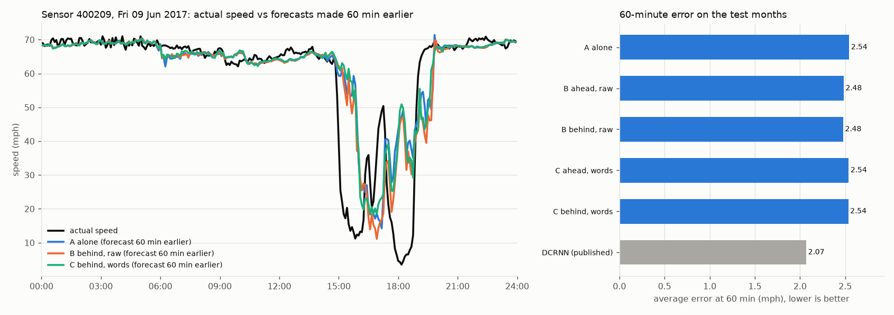
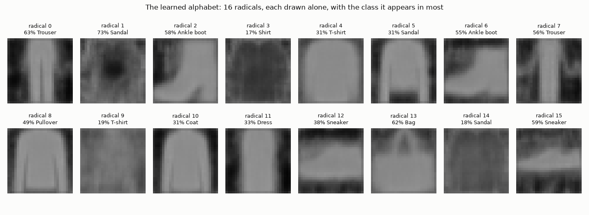

# features-abstractions-meaning

An experiment in building an **AI-native language for ML features**. Models compress what they learn into short "words" from a shared, growing vocabulary, so other models (and a reader LLM) can reuse that meaning instead of relearning it from raw data.

```
  RAW DATA (huge, messy)          THE "NEW LANGUAGE"            READERS
  Entity A: many events   ──►    vector A  ┐                ┌─► other models
  Entity B: ...           ──►    vector B  ├─ library of ───┤   (use as context)
  Entity C: ...           ──►    vector C  ┘   "words"      └─► decoder LLM
```

Like English: a small alphabet, an unlimited vocabulary, and short messages that carry a lot of meaning because the dictionary is shared. See [CLAUDE.md](CLAUDE.md) for the full vision and plan.

**Status:** proof of concept on public data: IBM Telco Customer Churn (7,043 customers, 19 input columns), Fashion-MNIST (70,000 28×28 clothing images) and, from experiment 11, PEMS-BAY road traffic (325 connected sensors, speed every 5 minutes for 6 months).

## In short

- **The idea:** a model squeezes raw data into a few discrete "words" from a shared, frozen dictionary, so other models (and an LLM) can reuse what it learned instead of starting from the raw data.
- **How it is tested:** 20+ experiments on Telco churn, Fashion-MNIST, PEMS-BAY road traffic and Telecom Italia. Every success bar is written down before the run and judged on the whole 95% confidence interval.
- **What worked:** an image becomes 8 bytes instead of 784, and the words beat raw pixels by about 4 points with 50 labels. Single words that carry meaning on their own (70% purity), a hash-verified SQLite library, and an off-the-shelf LLM that reads the words through their cards (78.6%) also held up. The gains are small and partly within noise on a retrained dictionary.
- **What failed:** on real telecom data the words lose to raw data on next-hour forecasting (1.8–2.5x the error), the unusual-activity signal turned out to be calibration, and connected sensors added only about 3.5% on traffic. The project-level bar was a clear fail.
- **Status:** in progress. The next step is a deliberate choice of which part of the claim to keep and test, with a new bar written first.


*Top: original images. Middle: rebuilt from 8 words (8 bytes). Bottom: single words drawn alone, with the class they mostly appear in.*

## Findings so far

| # | Experiment | Result | Takeaway |
|---|---|---|---|
| 1 | Hand-made feature `num_addon_services` added to the churn model | AUC 0.8448 → 0.8446 (no change) | The feature carries real signal (5% churn at 6 add-ons vs 46% at 1), but the model already learns it from the raw columns. |
| 2 | Autoencoder (model A) squeezes each customer into 4 numbers; model B predicts a new task (long contract) | raw 0.937 · raw+codes 0.936 · codes only 0.904 | 4 learned numbers keep most of the meaning of 18 columns for a task model A never saw, but add nothing on top of raw data. Not smaller than zip. |
| 3 | VQ-VAE: each customer becomes **4 words** from a learned 256-word vocabulary (4 bytes) | words only 0.912 · rebuild error 0.02 (unseen customers: 0.024, so not memorised) · **3.6x smaller than zipped raw data** | The first working form of the "language": a shared dictionary (4 KB) plus a 4-byte message per customer. Lossy, but beats zip on size. Caveat: bigger network and 3x more training than experiment 2's autoencoder, so not a perfectly fair comparison. |
| 4 | Image VQ-VAE (conv encoder, 28→14→7) learns 256 words from 60,000 images (no labels); each image becomes a 7×7 grid of **49 words** (49 bytes vs 784). Model B = logistic regression on 50–5,000 labelled images; both inputs are 784 numbers (pixels vs 49 words × 16-dim codebook vectors) | 50 labels: words 62.0% vs pixels 58.9% (±4) · 100: 69.5% vs 66.2% (±2) · 300 and 1,000: tie · 5,000: 81.1% vs 79.2% · words zipped 395 KB + 16 KB codebook vs 4,281 KB zipped pixels (**10.8x smaller**) | First time words beat raw data: model B learns faster from what model A learned. Gain is modest (~3 points, partly within the spread between random picks). |
| 5 | Experiment 4's words vs standard methods: PCA (49 numbers), PNG, JPEG | Words beat PCA by 9–11 points at 50–100 labels (PCA 50.5% / 58.8%) · rebuild error words 0.0050 vs PCA 0.0121 · 10x smaller than PNG, 4x smaller than JPEG q50 (but JPEG keeps ~3x more detail, rebuild error 0.0016) | Beats PCA, the classic compression for features, and beats file formats on size. Against JPEG it's a different trade-off, not a strict win: logos and fine patterns blur. |
| 6 | Words of words: a second VQ-VAE reads only the level-1 words and writes each image as a 4×4 grid of **16 level-2 words** (each summarising a 3×3 block of level-1 words). Model B over 20 picks | 50 labels: pixels 57.4% · level 1 61.3% · level 2 59.5% · 100 labels: 67.9% · 70.5% · 67.8% · level 2 recovers 44% of level-1 words · **29x smaller than zipped pixels** (16 bytes per image) | **Failed the bar fixed in advance** (level 2 was 1.8 / 2.7 points below level 1 at 50 / 100 labels; the bar allowed 1). A 3x shorter message, but it lost meaning model B needed. With 20 picks, level 1's win over pixels holds (+3.9 / +2.6 points). |
| 7 | Same-size test: our words vs a thumbnail and PCA at the same bytes per image (16 and 49), model B over the same 20 picks | Rebuild error: 16 B words 0.0143 vs PCA-16 0.0204 vs 4×4 thumbnail 0.0546 · 49 B words 0.0049 vs PCA-49 0.0121 vs 7×7 thumbnail 0.0330 · 50 labels: 16 B words 59.5% vs PCA-16 58.4% · 49 B words 61.3% vs 7×7 thumbnail 59.7% | **Failed the bar fixed in advance** (+5 points; got +1.1 / +1.7). Compression is real: words keep far more picture than standard methods at the same size. But for learning from few labels, a plain blurry 7×7 thumbnail already beats full pixels (59.7% vs 57.4%), so most of the words' gain over pixels comes from fewer, smoother numbers, not meaning. Also shows PCA-49 is a weak few-label baseline, so experiment 5's 9–11 point win over PCA overstates the words' advantage. |
| 8 | Predict instead of copy: words trained to rebuild the whole image while a random half is hidden (wide view: every word sees the whole image), vs a control with the same wide view trained to copy | Hidden-half rebuild error: predict 0.019 vs control 0.107 vs copy 0.105 · 50 labels: thumbnail 59.7% · copy 61.3% · control 61.7% · predict 60.7% | **Failed the bar fixed in advance** (main: +1.0 vs thumbnail, bar +5; cause: −1.0 vs control, bar +2). The predict model clearly learned what clothes look like (it redraws a hidden boot or trouser leg from the other half), but that knowledge didn't make its words easier for model B to learn classes from. |
| 9 | Reader grid: 4 readers (linear, bag of words, k-NN, small neural net) × thumbnail / copy / control / predict words / predict numbers before the snap × 50, 1,000 and all 60,000 labels | Predict vs control words: −0.1 points with all labels (linear), −1.1 at 50 labels (best reader); never ≥ +2 anywhere · before vs after snap: +0.1 · 60,000 labels, linear: words 86.7% vs thumbnail 81.0% · 50 labels, best: words +3.0 over thumbnail (MLP) · bag of words: 23–26% at 50 labels | **Words problem, by the bar fixed in advance:** experiment 8's hidden-half knowledge isn't in the words in a form any reader can use, and snapping to words loses nothing. But with many labels all our words clearly beat the thumbnail (+5.7 points), so they do hold more than a blur; with 50 labels the labels themselves are the bottleneck. Bag of words fails: these words only mean something at their grid position. |
| 10 | Self-contained words: each image becomes an unordered set of **8 words** (8 bytes); each word draws its own picture layer and the layers are added, so order and position can't carry meaning | **Word purity 70%** (grid words: 17%) · 50 labels: set words 61.3% (8 B) vs thumbnail 59.3% (49 B) vs PCA-8 58.9% (8 B) · bag of words 39.0% at 50 labels, but 71.2% vs 72.6% at 1,000 and 78.4% vs 77.9% at 60,000 · rebuild error 0.021 | **Passed 'words carry meaning', failed 'words are units' (bar fixed in advance).** First words that point to a class on their own (a single word drawn alone looks like a trouser or T-shirt), and 8 bytes beat a 49-byte thumbnail with 50 labels. Counting the words works with 1,000+ labels but not with 50, likely because 256 counts are too many features for 50 examples (untested). Ceiling is lower: 8 bytes can't hold everything (78–79% vs thumbnail 81–87% with all labels). |
| 11 | Raw-data baseline on PEMS-BAY (the standard benchmark: from a sensor's last hour, predict its speed 15 / 30 / 60 min ahead; train on the first 70% of time, test on the last 20%) | Average error (mph): last value 1.60 / 2.18 / 3.04 · LightGBM on raw readings 1.46 / 1.95 / 2.54 · LightGBM trains in ~12 s per horizon on 3M rows · raw data 68 MB (23 MB zipped) · published DCRNN: 1.38 / 1.74 / 2.07 | The bar every traffic experiment must match. Setup checks out: LightGBM lands between 'last value' and the published graph model. A plain model on raw data is already close to DCRNN at 15 min; the gap grows at 60 min, where knowing about neighbouring roads should matter most. |
| 12 | Neighbours' words on PEMS-BAY: each sensor's last hour becomes 2 self-contained words (trained on the training months to describe that hour and predict the next). Same LightGBM: A = own hour; B = + 5 nearest neighbours' raw hours (60 bytes); C = + their words (10 bytes) | Error at 15 / 30 / 60 min (mph): A 1.46 / 1.96 / 2.54 · B 1.45 / 1.93 / 2.48 · C 1.47 / 1.96 / 2.53 · training at 60 min: A 21 s, B 63 s, C 32 s | **Network helps: FAIL** (best cut 2.4%, bar 3%). **Words keep it: PASS on paper, but hollow:** C is within 2% of B only because B barely helps; the words kept about 1/6 of the raw neighbours' small gain (2.53 vs 2.48, A 2.54). Lesson: the bar should have asked words to keep most of the network's gain, not just stay close. All three forecasts still see a jam about an hour late. |
| 13 | Directional neighbours: the 5 nearest sensors **ahead** (downstream) or **behind** (upstream) along the road, instead of any direction; same LightGBM and same hour words as experiment 12 | 60-min error (mph): A 2.54 · raw ahead 2.48 · raw behind 2.48 · words ahead 2.54 · words behind 2.54 · DCRNN 2.07 | **Both failed** (direction: 2.6% cut, bar 3%; words kept 14% of the gain, bar 50%). Direction made no difference: any-direction, ahead and behind neighbours all give the same ~2.5%. So neighbour choice isn't the bottleneck. Two real limits: one shared LightGBM on 5 neighbours' last hour can only use a little of the network, and 2 words per hour are too coarse to carry what little it uses. |
| 14 | Word scorecard on Fashion-MNIST: flat words (experiment 10) vs a learned **Chinese-style alphabet** (each symbol = 1 of 16 radicals + 1 of 16 details, still 1 byte), each trained twice with different seeds | 50 labels: flat 60.0% · alphabet 59.2% · **radicals alone 54.7% (92% of the alphabet, with half the information)** · bag of words at 50: alphabet 47% vs flat 34% · stability between seeds: flat 51% (chance 4%) · alphabet 47% (chance 10%) · **radicals alone 72% (chance 31%)** | **Fair swap PASS, radicals carry it PASS; more stable FAIL, usable language FAIL** (best stability 51%, bar 70%). The 16 radicals look like real concepts (trouser legs, ankle boot, bag with handle, sneaker sole) and carry most of the meaning. But retraining gives back only about half the same symbols, so the language isn't stable yet: the coarse radicals are fairly stable, the fine details are not. |
| 15 | New speaker, frozen dictionary: experiment 14's dictionary (symbols + drawer) is frozen and a brand-new encoder learns to write in it from a fresh start, only by being understood; it never sees the original speaker's messages. Alphabet (the bars) and flat words (comparison) | Same symbols as the original speaker: **alphabet 58% · flat 69%** (from scratch in experiment 14: 47% / 51%; chance 1–3%) · same radicals 83% · model B trained on the original speaker reading the new one, 50 labels: alphabet −1.8 points, flat −0.4 · at 1,000 labels: −5.9 / −7.1 · new speaker's own accuracy −1.4 / −1.2 | **Understood by others PASS; same symbols FAIL (58%, bar 70%); quality kept FAIL (−1.4, bar 1).** Learning an existing language is far more stable than reinventing it (+11 to +18 points), and two independently trained speakers can communicate through the frozen dictionary with little loss at 50 labels. Not yet tight: with 1,000 labels, model B picks up speaker-specific details and loses 6–7 points. Flat words are the more learnable dictionary; the alphabet's radicals are the most stable part (83%). Note: reading messages as sorted sets costs some accuracy for the alphabet (54.8% vs 59.4% in slot order), so slot order carried some information. |
| 16 | Confidence check: key past claims re-tested with 95% confidence intervals on paired differences (both inputs on the same 20 picks of 50 labels); saved models, nothing retrained | Grid words vs pixels (exp 4): +4.0 [+3.1, +4.9] · set words vs thumbnail (exp 10): +1.8 [+0.7, +3.0] · set words vs PCA-8, bar +2 (exp 10): +2.8 [+1.9, +3.6] · alphabet vs flat, bar −1 (exp 14): −0.8 [−1.6, 0.0] · reading a new speaker, bar 2 (exp 15): −1.8 [−2.2, −1.3] · grid words vs thumbnail, bar +5 (exp 7): +2.0 [+1.3, +2.8] | **Two claims are clearly real:** words beat raw pixels (exp 4), and 8 set words beat a 49-byte thumbnail (exp 10), both small but outside the noise. Experiment 7's fail is a clear fail. **Three passes were too close to call** (exp 10 vs PCA-8, exp 14 fair swap, exp 15 understood by others): their intervals cross the bar. From now on the scorecard reports intervals, and a bar only counts as passed if the whole interval clears it. |
| 17 | PEMS-BAY post-mortem: can any reasonable forecaster get a real gain from neighbours' raw data? Three forecaster types, each without and with neighbours: shared LightGBM, one linear model per sensor, and a small graph network (mini DCRNN: messages along road links, two hops, both directions). Raw data only; 60-minute forecast; 95% interval by resampling test days | Gain from neighbours: LightGBM 2.4% [1.8, 3.0] · linear per sensor −0.1% [−1.5, 1.6] · graph network 3.5% [2.9, 4.0] · 60-min error: LightGBM 2.55 → 2.48 · linear 2.88 → 2.88 · **graph network 2.22 → 2.14** · DCRNN (published) 2.07 | **Network helps: FAIL** (bar set by the developer before running: ≥5% with the whole interval; best was 3.5%, clearly below). Neighbours' raw data gives a real but small gain (~2.5–3.5%). The surprise: most of the gap to DCRNN wasn't the network at all. The graph network *without* neighbours (2.22) already beats LightGBM with them (2.48), because a better forecaster for each sensor matters far more than its neighbours. Per the bar, the 'many connected points' part of the vision is revisited. Caveat: the per-sensor linear models were numerically ill-conditioned (warnings in the run), so their result is weak evidence; no rerun, per the bar. |
| 18 | Library v0: experiment 10's set words stored in one SQLite file (`fam/library.py`): the dictionary (256 symbols + drawer; frozen, versioned, hashed), its speaker, a message for each of the 70,000 images, a word card per symbol (from training labels only) and the scorecard. The file is then closed, reopened and read only through its query functions. No new encoder. Run on the second laptop, on the dictionary retrained there | Round trip: words identical, rebuild error 0.021595 from the library and from the model · model B through the library: 60.2%, identical on all 20 picks · 2/2 attempts to change the dictionary refused, hash verifies · **class from word cards alone: 76.7% [75.9%, 77.5%]** (bar 70%) · file 7.7 MB (the words: 0.56 MB; the dictionary: 0.16 MB), built in 1 s, queries 0.0–0.9 ms | **All four bars passed.** Three are exact checks that storing and reading back loses nothing; the fourth could have failed. Words can now be reused from the library alone, with no model file. A reader that only looks up each word's card and adds the class shares gets 76.7% with no training, close to a trained bag-of-words reader with all labels (78.3% on this machine). Not a few-label result: the cards were measured on all 60,000 training labels. Caveats: the file is 14x bigger than the words in it (the lookup index, labels, cards and the encoder), and single words are less stable than the average suggests (median 51% come back in a second training; 41 of 256 reach 70%). |
| 19 | Reader LLM, phase 1 (no training): Claude Opus 5.5 via the Claude API reads a test image's 8 words plus their word cards from Library v0, and answers with a class, a confidence and the words that decided it; 500 test images, compared with the card vote on the same images. A stand-in: the goal is the developer's own tailored reader | LLM 78.6% [75.0, 82.2] · card vote 78.8% [75.2, 82.4] · paired difference −0.2 [−1.5, +1.1] · 100% of answers cite only the image's own words · confidence ≥ 0.8 on 280 answers: 94.6% right; below 0.8 on 220: 58.2% · 0 refusals · 439k tokens in, 42k out, **$2.60**, 7 min | **All three bars passed.** An LLM can read the language through its word cards: it matches the arithmetic card vote, never invents words, and knows when it's unsure (95% right when confident, 58% when not). It adds no accuracy over the vote; what it adds is explanations and a usable confidence, which is what a 'fall back to raw data when unsure' library needs. Same caveat as experiment 18: the cards were measured on all 60,000 training labels. This 78.6% is the baseline the developer's own reader (phase 2) has to beat, ideally without cards. |
| 19b | Two free checks on experiment 19's saved answers (no new API calls, no training): does the LLM just copy the card vote, and is its confidence just the vote's margin? | **Agreement with the vote: 97.6% [96.3, 98.9]** of 500 images · LLM's 280 confident answers 94.6% right vs the vote's 280 highest-margin images 93.9% (262 of the 280 are the same images) · difference +0.7 [−3.3, +4.7] · the other 220: 58.2% vs 59.5% | **Check A: the LLM reads the cards the same way the vote does; it adds explanations, not judgement. Check B: the confidence comes from the cards, not the LLM.** Experiment 19's three passes hold, but what they show is that the cards are readable and the vote's margin already says when to trust them. Phase 1 adds explanations in words, nothing more. A tailored reader is only worth building if it adds judgement the cards plus counting don't have. |
| 20 | **Telecom reuse test, the project's one-shot test** (Telecom Italia, Milan, 10,000 grid squares, hourly SMS / calls / internet; train 4–17 Nov 2013, test 18–24 Nov). One dictionary (8 set words from 256, trained only to rebuild a square's last 24 hours) reused for 3 next-hour questions; the same LightGBM on words trained on a fixed random 2% of the training examples (share set by a rule committed beforehand, experiment 20a) vs raw data trained on 100%; 95% intervals over 100 spatial blocks | Words at 2% vs raw at 100%: **internet +156% [+149, +165]**, **calls +80% [+77, +84]**, unusual activity +3.8% [−18.5, +27.2] · safeguard met (raw at 2%: +4.2%, +5.1%, +29.5%) · reported only: words at 100% vs raw at 100%: internet +152%, calls +77%, unusual −20.8% [−37.5, −3.1] (better, the interval excludes zero, but not clear of option A's 5% threshold) · words 8 bytes vs 288, words at 2% train in 5–7 s vs 73–98 s for raw at 100% · unusual hours: 1.2% of training, 3.6% of the test week | **CLEAR FAIL of the project-level bar** (0 of 3 pass, 2 clear fails): rethink the claim, not the encoder. As written down before the run, words that blur the exact last value can't compete on next-hour forecasting; even with all the data they have 1.8–2.5x the error. One weak signal points the other way: on unusual activity, the one question that doesn't hinge on the exact last hour, words at 100% were better than raw at 100% (−21%, interval [−38%, −3%] excludes zero) but don't clear option A's own 5% threshold, so it's too close to call by that measure; reported, not counted. Before calling it a lead, a free check has to tell meaning from calibration (next steps). Caveat: unusual hours were 3x more common in the test week than in training. |
| 20b | Is experiment 20's unusual-activity signal meaning or calibration? Its two Q3 models (raw and words at 100%) refit with the same inputs, settings, dictionary and seeds, then compared by AUC, which measures ranking only; 95% interval over the same spatial blocks | Reproduced experiment 20 exactly (log loss 0.1912 / 0.1515) · **AUC raw 0.834, words 0.780: words minus raw −0.054 [−0.075, −0.036]** · reported only: raw at 2% 0.849, words at 2% 0.685 · average predicted chance raw 1.8%, words 1.2%, actual 3.6% | **CALIBRATION, by the bar fixed beforehand: no evidence of meaning.** At ranking which hours are most likely unusual, raw data is clearly better than the words. Experiment 20's lower log loss for the words came from probabilities that happened to suit a test week with 3x more unusual hours, not from knowing more. So on telecom the words lose to raw data on all three questions, and rethink direction (2), unusual activity as the real use case, has nothing behind it on this data. |
| 21 | Correction words (predictive coding, step 6's choice): word 1 predicts a square's 24-hour pattern and each further word encodes what is still missing (residual quantization, up to 16 words, 1 byte each); next-hour forecasting with messages of 1, 2, 4, 8 and 16 words vs raw data, both on 100% of the training examples; everything else as experiment 20 | **Run 2 (counts):** at 16 words internet **+275% [+260, +291]**, calls **+153% [+144, +163]** vs raw data (bar: below +10%); 16 words better than 1 (−63%, −57%) · the dictionary's training broke in both runs: rebuild error with 16 words fell to 0.057 at pass 3 of run 2 (0.097 after pass 1 of run 1), then rose to 0.984 by pass 6, leaving a final dictionary that carries almost nothing (rebuild error 0.959 at every message length) · experiment 21a (training data only) found the learning rate as the cause at 300,000 windows; at 1,000,000 windows the lower rate only delayed the breakdown | **FAIL, counted as committed (developer's decision, 2026-10-07):** per the bar, the forecasting fix is dropped. What failed is the training, not the idea: this coarse-to-fine dictionary couldn't be trained stably with this recipe, so the mechanism itself is untested, not disproven. The one hint, from before each breakdown: 16 correction words rebuilt a day of telecom history better than any dictionary so far. Making that training stable would be its own step with its own bar, not a rerun of experiment 21. |
| 22 | Can the correction-word dictionary be trained properly? Experiment 21's dictionary and 1 million training windows, with the learning rate (0.0005) lowered to zero over 6 passes and the best pass kept; training data only, no forecasting; judged by the health gate | 16-word rebuild error pass by pass: 0.094 / 0.060 / **0.055** / 0.074 / 0.177 / 0.418 · kept pass 3: 1 / 4 / 16 words 0.293 / 0.081 / 0.055 · entries in use fell from 3,852 to 3,247 | **FAIL by the health gate** (the last pass is 7.6x the best, against the 10% allowed); the other two checks passed. The training broke again, at passes 4–6, even though the learning rate was shrinking toward zero, so step size alone doesn't explain it. Per the stop rule: no forecasting (experiment 23 doesn't run) and nothing new is built until the engineering problem has been looked at together. |
| 22a | Diagnosis after the engineering review: experiment 22 exactly, with the revive step switched off; training data only; decision rule committed before running | 16-word rebuild error 0.073 / 0.075 / 0.069 / 0.068 / 0.066 / **0.064**, stable to the last pass; 1-word error steady around 0.33 · entries in use fell from 3,680 to **800 of 4,096** | **Revive is confirmed as the trigger.** Its jumps aren't scaled by the learning rate and shift the first dictionary, whose leftovers all later dictionaries describe. Without revive the training is stable and keeps improving, at the cost of an unused majority of the dictionary (a smaller effective vocabulary). In plain terms, 16 words capture about 94% of a square's 24-hour pattern, but a single hour's count is still off by about 40–50%. |
| 22b | Experiment 22 with revive off (the review's fix), under experiment 22's health gate unchanged | 16-word rebuild error 0.074 / 0.071 / 0.068 / 0.065 / 0.063 / **0.063**; kept 1 / 4 / 16 words 0.357 / 0.128 / 0.063; 807 of 4,096 entries in use | **HEALTHY: passed all three checks.** The correction words can now be trained reliably. |
| 23 | Experiment 21's forecasting bar, unchanged, on experiment 22b's healthy dictionary (the first fair test of the correction words) | Next hour vs raw data, k = 1 / 2 / 4 / 8 / **16** words: internet +412% / +286% / +244% / +204% / **+121% [+111, +132]**; calls +207% / +138% / +118% / +95% / **+60% [+55, +66]** · 16 words beat 1 (−57%, −48%) · unusual activity about −8% (too close to call) | **FAIL, on a healthy dictionary.** Every extra correction word cuts the error, steadily and with no sign of flattening at 16, so the predictive-coding mechanism works as designed. But 16 words don't replace raw data for next-hour forecasting (2.2x raw's error on internet, 1.6x on calls), as written down before the run: the words know each past hour only to about ±40%. Per byte the correction words aren't better than the set words (8 of them: internet +204% vs experiment 20's 8 set words +152%). Per the stop rule: review together, engineering or idea? |
| 24 | Dictionary audit of experiment 22b's dictionary (nothing new built; training weeks only: fit on week 1, check on week 2): A information per word position, B rebuild error by hour, C forecasting from the encoder's 32 numbers before snapping vs the 16 words vs raw data | A: **60.3 of 128 bits** (7.5 of 16 bytes); the first 12 positions carry only about 3 bits each (like 8 of their 256 words), the last two 6.6 and 7.8 · B: last hour 1.08x the 24-hour average (no cause) · C, next-hour error: internet raw 0.103 / **encoder numbers 0.196** / 16 words 0.218; calls 0.161 / 0.208 / 0.225 | **Two specific causes, by the rule fixed before running.** (1) **The encoder's squeeze** (internet: its 32 numbers already have 1.9x raw data's error, before any snapping): this is a ceiling, since the words can only lose from there, and they lose little (1.11x and 1.08x). More or better words can't close the gap while the encoder throws the information away. (2) **Collapse** wastes about half the message (60 of 128 bits). The last hour isn't rebuilt worse than the others, so the training goal's balance across hours isn't the problem. Per the rule: a fix is designed together, with its own bar, before anything is built. |
| 25 | A predictive encoder (fix 1 from the audit): the correction words are trained to rebuild the past 24 hours and predict the next 6 (training weeks only); health gate, then experiment 21's forecasting bar unchanged on the test week | Health gate passed (combined 16-word check error 0.147, stable; past-part rebuild 0.072) · next hour vs raw data: **encoder's 32 numbers internet +84% [+76, +93], calls +35% [+31, +38]**; **16 words internet +115% [+105, +126], calls +48% [+44, +53]**; 16 words beat 1 (−64%, −59%) · 54.1 of 128 bits in use; 1-word messages got coarser (combined error 0.68 → 0.84 during training) | **FAIL, on a healthy dictionary.** Training to predict helped only a little (16 words: internet +121% → +115%, calls +60% → +48%), and the squeeze barely moved (the encoder's numbers still about 1.8x raw data's error on internet). So the limit isn't what the encoder is trained for but precision: raw data forecasts the next hour to about ±10%, and a compact summary of 72 numbers already blurs each past hour by about that much. A summary can describe a day's shape and type, but it can't replace the exact recent values next-hour forecasting needs. Per the stop rule: review together. |

All Telco AUCs are averaged over repeated cross-validation splits (15 for experiment 1, 10 for 2–3), so one lucky test split can't decide a result. In experiments 2–3, model B predicts a different task (long contract vs month-to-month) with the `Contract` column hidden from both models. Image accuracies are averaged over 5 random picks of labelled images per size, tested on the 10,000 test images.

Experiment 4, originals (top, 784 bytes) vs rebuilt from 49 words (bottom, 49 bytes):


Experiment 6, originals (top) vs rebuilt from 49 level-1 words (middle) vs from 16 level-2 words (bottom):


Experiment 8, half of each image hidden (top row) and each model's guess at the whole image. Only the predict model fills in the missing half:


Experiment 10, originals (top), rebuilt from 8 self-contained words (middle), and the 10 most used words each drawn alone, with the class they mostly appear in (bottom):


Experiment 12, one test-month rush hour on sensor 400209: actual speed vs forecasts made 60 minutes earlier (left), and error by horizon against the published DCRNN (right):


Experiment 13, the same jam with neighbours chosen along the direction of traffic:



Experiment 14, the learned alphabet: each of the 16 radicals drawn alone, with the class it appears in most:



### What we've learned

- **On small, clean data, raw features win.** Telco is small and clean; LightGBM finds the patterns itself, even from 50 labels. The learned language matters more where raw data is big, messy, or hard to read directly (images helped; Telco didn't).
- **Discrete words beat continuous codes.** Same idea, but snapping to a vocabulary gave better accuracy and real compression.
- **Messier data gives the language more room.** Images compressed 10.8x (vs 3.6x on Telco), and words helped model B with few labels.
- **Current words are low-level.** Each image word describes a 4×4 patch ("edge here"), not a concept ("shoe sole"). The gain over pixels is modest (~3 points) and partly within noise.
- **Squeezing harder isn't the same as abstracting.** Level 2 was trained to rebuild the level-1 words, so it kept what the image *looks like* at lower resolution (blurrier shapes) rather than what it *is*. Shorter messages, but the lost detail was detail model B used. A rebuild objective may not be enough to make higher-level words more meaningful.
- **Words trained to rebuild are good compressors, not yet meaningful.** At the same size they keep 1.4–2.5x more of the picture than PCA, but a simple thumbnail gets most of their few-label gain. Experiments 2, 6 and 7 all point the same way: to carry meaning, words probably need a different job, such as predicting a hidden part or what comes next, rather than rebuilding the input.
- **Knowing isn't the same as being easy to read.** In experiment 8 the predict model learned real knowledge about clothing shapes, yet model B (a simple linear reader with 50 labels) did no better with its words. The knowledge may sit in the decoder, or in a form a linear reader can't use. Open question: is the problem the words, or the reader?
- **It was the words, not the reader (experiment 9).** No reader (linear, k-NN, neural net) and no amount of labels made the predict words beat the control. The extra knowledge from predicting stays in the model, not in its 49 words. Two more lessons: with all 60,000 labels the words beat a thumbnail by 5.7 points, so they do carry more than a blur, but 50 labels are too few for any reader to use it; and our words are not yet like a language's words, since counting them without their positions loses most of the meaning.
- **Forcing words to stand alone gave them meaning (experiment 10).** When words can't lean on position (an unordered set whose picture layers are added), each word learns a whole-garment concept: word purity jumped from 17% to 70%, and 8 such words beat a 49-byte thumbnail with 50 labels. It's the first step from pixel codes toward a vocabulary. Trade-off: 8 bytes keep less detail, so the ceiling with many labels is lower.
- **Simply adding neighbours isn't enough (experiment 12).** Giving a sensor its 5 nearest neighbours' last hour cut the 60-minute error by only 2.4% (raw) or 0.4% (words), far from the published graph model DCRNN. Likely reasons: the neighbours are picked by distance, not by direction of traffic (upstream jams are what arrive next), and one shared LightGBM can't learn which neighbour matters for which sensor. The network idea needs the connections to carry direction and learned weight, which is what graph models do. Experiment 13 tested the direction idea and it made no difference (ahead, behind and any direction all gave ~2.5%), so the limit is the forecaster and the words, not which neighbours are chosen. The forecaster can only use a little of the network (raw neighbours: 2.5% better), and the words keep only a seventh of that. Words can only keep a gain the forecaster can find.
- **A learned alphabet works, but the language isn't stable yet (experiment 14).** Building symbols from 16 radicals + 16 details costs almost nothing in accuracy, and the radicals alone carry 92% of the meaning, so the model discovers a small alphabet of real concepts (trouser legs, boot, bag, sole) on its own. But two trainings agree on only about half their symbols (far above chance, far below what a shared language needs). The coarse radicals are the stable part (72%); the fine details aren't. Stability is now the main open problem for the words.
- **A shared language should be learned, not reinvented (experiment 15).** Freezing the dictionary and training a new speaker to write in it raised agreement from about half to 58–69%, and a model B trained on one speaker could read the other with almost no loss at 50 labels. That's the first evidence that two independently trained models can communicate through a shared dictionary. It isn't tight yet: with more labels, readers learn each speaker's quirks and lose 6–7 points reading the other.
- **Some passes were luck-sized (experiment 16).** Re-checked with confidence intervals, the two core claims hold (learned words beat raw pixels, and 8 meaningful words beat a 6x bigger thumbnail with few labels), but three earlier passes sit within the noise. Bars are now judged on the whole 95% interval, not just the average.
- **On PEMS-BAY, the network is worth only ~3% (experiment 17).** Three different forecasters all got small gains from neighbours' raw data (best 3.5%, below the 5% bar), so experiments 12–13 weren't held back by a weak forecaster. A better forecaster per sensor mattered far more (graph network without neighbours: 2.22 mph vs LightGBM 2.55). So on this data, 'many connected points sharing words' has little to gain: the 'connected points' part of the vision needs rethinking (where would neighbours carry much more information, e.g. sensors with little history of their own, or data where events spread between points?).
- **The words can live in a library, and the cards hold most of their meaning (experiment 18).** Stored once in a SQLite file, the set words give exactly the same results read back as read from the model, and the dictionary can't be changed once stored. Each word's card (which classes it appears on, what it draws, how stable it is) is enough to name an image's class 76.7% of the time without training anything, which is the ceiling to expect from a reader LLM that only reads cards. The storage claim needs care: the words are 8 bytes per image, but the file is 14x bigger once it can be searched.
- **Retraining is not the same as copying (second laptop, 2026-10-05).** Experiments 4, 10, 14, 15 and 16 were rerun on a second machine with the same seeds. Everything that involves no training matched exactly (thumbnail, PCA, Telco, traffic), but the retrained set-word dictionary came out about 1 point lower at 50 labels (60.2% vs 61.3%). On that dictionary, experiment 16's check of "8 set words beat the thumbnail" is too close to call (+0.9 [−0.4, +2.2], against +1.8 [+0.7, +3.0] above), while "understood by others" becomes a clear pass (+1.0 [+0.6, +1.4]). So that win depends on which training of the dictionary is used, and a dictionary is only the same dictionary if its file is copied, which is what the library's hash is for. The table above keeps the first machine's numbers.
- **An LLM can read the language (experiment 19).** Given only an image's words and their cards, Claude named the class as well as the card vote (78.6% vs 78.8%), cited only real words, and its confidence was meaningful: on the 56% of images where it was confident it was right 95% of the time. So the language is readable by a general-purpose AI with no training, and it can say when its words aren't enough, which is the 'fall back to raw data' part of the long-term picture. It doesn't beat simple counting; a tailored reader has to. Experiment 19b checked what the LLM itself adds: it picked the vote's class 97.6% of the time, and its confidence was no better than the vote's own margin (+0.7 points [−3.3, +4.7]). So the meaning and the 'when to trust it' both come from the word cards; the off-the-shelf LLM only turns them into sentences.
- **Telecom: the words can't replace raw data for next-hour forecasting (experiment 20).** In the project's one-shot test, the bar fixed before any telecom result failed clearly: words had 1.8–2.5x raw data's error on next-hour internet and calls, even with all the training data, because 8 words describing the last 24 hours blur the exact recent level that forecasting leans on. The claim "words learned once can replace raw data across tasks" is false here. One weak signal: on unusual activity, which doesn't hinge on the exact last value, words with all the data were better than raw data (−21%, interval excludes zero) but not clear of option A's 5% threshold, so too close to call; reported, not counted. It may come from meaning (the words know what's normal for a square) or only from calibration (unusual hours were 3x more common in the test week, and log loss punishes over-confident models); a free AUC check tells them apart. Either way it fits the rethink written down before the run: words as a cheap summary for tasks that don't need the exact last value.
- **The unusual-activity signal was calibration (experiment 20b).** Compared by AUC, which ignores calibration, raw data ranks unusual hours clearly better than the words (0.834 vs 0.780). The words' lower log loss in experiment 20 only reflected less over-confident probabilities in an unusual test week. On telecom, the current words lose to raw data on every question tested.
- **Correction words: untested, because the training broke (experiment 21).** The predictive, coarse-to-fine words of step 6 failed their bar in the counted run, but only because the dictionary's training broke in both runs: after a promising start (16 words rebuilding a day better than any dictionary so far), the error rose until the final dictionary carried almost nothing. The diagnosis on a smaller sample pointed at the learning rate, but at full size the lower rate only delayed the breakdown. The lesson for the process: a short smoke run can't catch a breakdown that only appears after several passes, so dictionary training needs its own health check before anything is built on it.
- **The precision limit (experiments 22b–25).** Once the correction words could be trained reliably, every extra word kept helping, but even 16 words trained to predict stayed at 1.5–2.2x raw data's next-hour error. The audit (experiment 24) located the loss before the words, in the encoder's squeeze, and training it to predict (experiment 25) barely moved it. A compact learned summary blurs exact values, and next-hour forecasting lives on exact recent values. The developer's response: a two-part language, like Chinese characters with a meaning part and a part that pins down exactly which one (experiment 26).

### Next steps

**Current plan (after experiment 17; see CLAUDE.md "Plan"):** the experiments drifted into word-encoding variants while the library and the traffic question waited, so the order is now:
1. ~~**PEMS-BAY post-mortem (experiment 17)**~~ **Done: FAIL.** Neighbours give every forecaster only ~2.5–3.5%, so "many connected points" is under review and the library stores point and time as plain labels.
2. ~~**Library v0:**~~ **Done: all four bars passed** (experiment 18). SQLite end-to-end on experiment 10's set words: dictionaries, word cards, messages, scorecards, queries.
3. **Reader LLM:** ~~phase 1, an off-the-shelf LLM reading word cards~~ **done: all three bars passed** (experiment 19, Claude Opus 5.5, $2.60). Phase 2, the developer's own tailored reader, is **parked** (2026-10-06): experiment 19b showed the value is in the dictionary and its cards, not the reader. Unpark it only when the specific gap a reader would fill is written down first, in one sentence (the same tripwire as for encoders).
4. ~~**Project-level bar, then the telecom reuse test**~~ **Done: CLEAR FAIL** (experiment 20). Rethink triggered, per the plan written before the run.
5. ~~**A free check on the unusual-activity signal (experiment 20b)**~~ **Done: CALIBRATION.** Raw data ranks unusual hours better than the words (AUC −0.054 [−0.075, −0.036] for words), so direction (2) below is unsupported on this data.
6. **Rethink direction chosen (2026-10-07, by the developer): predictive, coarse-to-fine words** (step 6's "fix forecasting" option). The idea, from predictive coding (a higher level predicts, and only the error is passed on): the first word is a prediction of the whole 24-hour pattern ("a weekday-evening square, a normal day"), and each further word encodes what the words so far still get wrong, so an item gets more words only where it's surprising. In ML terms: residual quantization, trained so that every prefix of the message is usable. **Written gap (the encoder tripwire):** experiment 20 showed that 8 set words blur the exact recent level that next-hour forecasting needs (1.8–2.5x raw data's error even with all the data), and no existing encoder can add detail where an item needs it. **First, experiment 21, a mechanism check** (bar in the README): does adding correction words close the gap to raw data on next-hour forecasting? It can't prove the claim (fixed message lengths, no stopping rule), so it runs before the new project-level bar. **If it works, the next step is the adaptive version** (add words until the error is small enough), and a **new project-level bar** must be written and committed before that test runs. If it fails, the forecasting fix is dropped, and the remaining choice is option (1), narrowing the claim, or writing the project up. The PEMS-BAY reuse test stays on hold. **Experiment 21: FAIL, counted as committed (2026-10-07).** At 16 words, internet +275% and calls +153% vs raw data (bar: +10%). But the dictionary's training broke in both runs (rebuild error with 16 words fell to 0.057, then rose to 0.984 by pass 6); a diagnosis on training data blamed the learning rate, and at full size the lower rate only delayed the breakdown. So the mechanism is untested, not disproven, and per the bar the forecasting fix is dropped for now. Making the coarse-to-fine training stable would be its own step with its own bar (and a training health check), not a rerun of experiment 21. **Next (decided 2026-10-07): experiment 22, a stable-training step for the correction words (training data only), then, only if it passes, experiment 23, experiment 21's forecasting bar once on the healthy dictionary.** Stop rule (the developer's, before either runs): if either fails, nothing new is built; go back to the engineering problem together first, with writing the project up as the default after a failed experiment 23. Bars in the README. **Experiment 22: FAIL by the health gate** (the training broke again at passes 4–6, even with the learning rate shrinking to zero; best pass 0.055, last 0.418). **The engineering review found revive as the trigger** (experiment 22a: stable without it, but only 800 of 4,096 entries in use). **Decided (option A): experiment 22b retrains with revive off under the same health gate, then experiment 23 runs experiment 21's forecasting bar once on that dictionary.** The anchored training (the developer's idea: freeze each level once it settles, with a rollback that comes with a change) is the fuller fix for later, to bring back a gentle revive. Bars in the README.

No new encoder variant unless one of these steps reveals a specific gap, written down first.

**Success bar for experiment 17, fixed before running** (PEMS-BAY post-mortem: can any reasonable forecaster get a real gain from neighbours' raw data? Raw data only, no words. Three forecaster types, each trained without and with neighbours, everything else identical: shared LightGBM (as in experiments 12–13), one linear model per sensor (each sensor learns its own neighbour weights), and a small graph network passing information along road links, two hops, both directions. 60-minute forecast, test months; 95% confidence interval by resampling whole test days):
- *Network helps* (bar set by the developer before any results, replacing an earlier 10% draft): the same forecaster with neighbours vs without cuts the 60-minute error by at least 5%, and the whole 95% interval clears 5%.
- *Fail means:* no reasonable forecaster finds a real neighbour gain on PEMS-BAY, so "many connected points" is revisited, not just the library's time column dropped.
- *Too close to call:* the interval crosses 5%, which counts as not shown; no rerun with tweaks.

**Result: FAIL.** Best gain 3.5% [2.9%, 4.0%] (graph network), a clear fail. See experiment 17.
- *Context, no bar:* the best forecaster's 60-minute error against the published DCRNN (2.07 mph).

**Success bar for experiment 18, fixed before running** (Library v0: one SQLite file holding experiment 10's set-word dictionary (frozen, versioned, hashed), its speaker, one message per image, one word card per symbol and the scorecard, read back only through the library's query functions. No new encoder. Approved by the developer on 2026-10-05. The dictionary is the one retrained on the second laptop, where experiment 10 gives 60.2% at 50 labels, not the 61.3% in the table above):
- *Round trip:* every test image's words read from the library are exactly the words experiment 10's model writes, and rebuilding the test images from the library alone (dictionary and messages, no model file) gives the same rebuild error to 6 decimals.
- *Reuse through the library:* model B reading words only through the library gets exactly the same accuracy, on each of the same 20 picks of 50 labels, as reading experiment 10's model directly.
- *Frozen:* an attempt to change or delete a stored dictionary fails, and its hash still verifies.
- *Cards carry the meaning:* predicting each test image's class from its word cards alone (each of its 8 words votes with its card's class shares, computed from training labels only; no model B is trained) reaches at least 70%, and the whole 95% interval clears 70%.
- *Reported, no bar:* the library file's size, the time to build it, and the time per query.

**Result: all four passed.** Round trip exact, reuse exact, frozen holds, and class from word cards alone 76.7% [75.9%, 77.5%], a clear pass of the 70% bar. See experiment 18.

**Success bar for experiment 19, fixed before running** (reader LLM, phase 1, no training: Claude Opus 5.5 through the Claude API reads an image's 8 words plus their word cards from Library v0 (as text, e.g. `<w86>: 87% Trouser...`) and answers with the class, a confidence from 0 to 1, and the words that decided it. Chosen by the developer on 2026-10-06 as a stand-in: the goal is still the developer's own tailored reader (phase 2), which this sets the baseline for. 500 test images, a fixed random sample; compared with the card vote of experiment 18 on the same images; the library built from this laptop's dictionary):
- *Reads the language:* the LLM's accuracy is no more than 3 points below the card vote on the same 500 images, with the whole 95% interval of the paired difference above −3 points.
- *Grounded:* at least 95% of answers cite only words that are actually in that image's message.
- *Knows when it's unsure:* accuracy on answers with confidence ≥ 0.8 is at least 10 points higher than on answers below 0.8.
- *Reported, no bar:* cost, tokens and time.

**Result: all three passed.** Reads the language −0.2 points [−1.5, +1.1] vs the vote (clear pass), grounded 100%, knows when unsure +36.5 points. See experiment 19.

**Success bars for experiment 19b, fixed before computing** (two free checks on experiment 19's saved answers: no new API calls, no training, no new encoder; the same 500 test images; intervals from `fam/scorecard.py`):
- *Check A, does the LLM just copy the vote?* Agreement = share of the 500 images where the LLM's class equals the card vote's class, with a 95% interval. If the whole interval is ≥ 95%: record "the LLM reads the cards the same way the vote does; it adds explanations, not judgement." If it is below 95%: report, on the images where they disagree, who is right more often, with intervals.
- *Check B, is the LLM's confidence just the vote's margin?* Vote margin = top class share minus runner-up share, from the same cards. Take the 280 images with the highest vote margin (ties broken by image order; 280 = the number of LLM answers with confidence ≥ 0.8) and compare their accuracy with the LLM's 280 confident answers; also report accuracy on the remaining 220 for both. Paired difference, per image over all 500: (in the LLM's confident set and right) minus (in the vote's top-margin set and right), times 500/280, whose mean is the accuracy difference between the two sets of 280. The LLM's confidence counts as adding something only if the whole 95% interval of that difference is above 0. Otherwise record "the confidence comes from the cards, not the LLM."

**Result:** Check A 97.6% [96.3%, 98.9%], so the LLM reads the cards the same way the vote does and adds explanations, not judgement. Check B +0.7 points [−3.3, +4.7], which crosses 0, so the confidence comes from the cards, not the LLM. See experiment 19b.

**Success bar for experiment 20, fixed before running: the telecom reuse test, the project's one-shot test** (applies the bar for the PoC as a whole in CLAUDE.md, option C "less data", set 2026-10-06):
- *Data:* Telecom Italia, Milan, all 10,000 grid squares (a 100 × 100 grid, numbered row by row). Hourly totals per square, Milan local time, of SMS (in + out), calls (in + out) and internet: the six 10-minute readings and all country codes summed, missing or blank readings counted as 0, then log(1 + x). Train: Mon 4 – Sun 17 Nov 2013 (336 hours); test: Mon 18 – Sun 24 Nov (168 hours).
- *Examples:* a square at hour t, predicting hour t + 1, with t + 1 inside the period. Each example's history is that square's last 24 hours (t − 23 … t); test examples may reach back into the training weeks, which is past data. About 3.1 million training and 1.7 million test examples.
- *Dictionary:* experiment 10's set-word recipe (an unordered set of 8 words from a 256-word dictionary, 16 numbers per word; each word draws its own layer and the layers are added) applied to the 24-hour history (24 hours × 3 activities = 72 numbers, each activity standardised with its training-period mean and spread). Trained only to rebuild that 24-hour history: no future hours and no question answers. 1 million training-period windows (fixed random sample, seed 0), 6 passes, batch 1,024, Adam at 0.002. Same recipe with settings for this data, not a new encoder variant.
- *Questions (all about hour t + 1):* **Q1 internet**: log(1 + internet), error = mean absolute error. **Q2 calls**: log(1 + calls), error = mean absolute error. **Q3 unusual internet**: 1 if log(1 + internet) differs from the square's typical value by more than log 2 (more than double or less than half), where typical = that square's median log(1 + internet) at that hour of day over the training weeks, weekdays and weekends separately; error = log loss. How often the flag occurs is reported for both periods.
- *Inputs, the same extras on both sides:* raw = the 72 history numbers (log scale) + hour of day + weekend flag. Words = the history's 8 words, sorted by word number (the message is an unordered set), each looked up as its 16-number dictionary vector (128 numbers), + hour of day + weekend flag.
- *Model, identical for every arm, no tuning per arm:* LightGBM, 300 trees, learning rate 0.1, 63 leaves, random_state 0; regression (squared error) for Q1 and Q2, binary for Q3.
- *Arms:* raw on 100% of the training examples; words on a fixed random 10% (seed 0); raw on the same 10% (same rows); words on 100% (reported only).
- *Measure:* relative error difference on the test week, (error of words at 10%) / (error of raw at 100%) − 1, with a 95% interval from resampling **spatial blocks** (the 100 blocks of 10 × 10 squares, 2,000 draws), because neighbouring squares behave alike and resampling single squares would make the intervals too narrow.
- *Pass:* on at least 2 of the 3 questions the whole interval is below +2%, **and** for each of those questions the safeguard holds: raw at 10% is worse than raw at 100% by more than 2%, with the whole interval (otherwise 10% wasn't a real handicap, and that question can't count).
- *Clear fail:* on at least 2 of the 3 questions the whole interval is above +2%: rethink the claim, not the encoder. *Anything else:* too close to call, which counts as not shown; no reruns with tweaks.
- *Reported, no bar:* option A (words at 100% vs raw at 100%), option B (bytes per example and training time per arm), raw at 10%, the dictionary's rebuild error.
- *Expectation, written before the run:* next-hour forecasting leans heavily on the exact last hour. Raw data gives the model that number exactly, while 8 words rebuilt from 24 hours blur it, so Q1 and Q2 may fail even if the words are good. That's a fair test of the claim, not a reason to change the bar, and a fail on Q1 and Q2 can't be explained away afterwards as "the wrong question".
- *Dated change, 2026-10-06, before the official run: the 10% becomes a share set by a rule.* A smoke run (400 squares, 20 trees, a dictionary trained for 1 pass; not a result) showed that raw data barely degrades at 10% (about +1% vs 100%), so the safeguard would rule out any pass before anything runs. The same smoke run also showed the words far behind raw data on internet and calls (+87% and +36%), and both are recorded here so a reader can judge the change. **The rule:** use the largest share from {10%, 5%, 2%, 1%, 0.5%, 0.2%, 0.1%} at which raw data at that share is worse than raw data at 100% by at least 5% on at least 2 of the 3 questions, measured inside the training weeks only (fit on week 1, check on week 2; the test week is not touched), with the bar's model settings. The rule looks at raw data only, never the words, and lowering the share can only make the words' task harder. The chosen share replaces "10%" everywhere in this bar (words and raw at that share, the same fixed random rows, seed 0); the safeguard stays as written. The rule's result is committed on its own before the official run. **Rule result (experiment 20a): 2%.** Raw data at each share vs at 100%, fit on week 1 and checked on week 2 (internet / calls / unusual): 10% +1.5% / +2.4% / −7.6%; 5% +2.4% / +4.4% / +4.6%; **2% +5.6% / +8.0% / +8.8%** (the largest share meeting the rule); 1% +7.7% / +10.1% / +7.9%. So the official run compares words trained on a fixed random 2% of the training examples with raw data trained on 100%.
- *If it fails, "rethink" looks at this (written before the run):* (1) whether the claim should narrow from "words replace raw data for every task" to "words are a cheap, reusable summary for tasks that don't need the exact last value", and (2) whether questions like unusual activity, which don't hinge on the exact last hour, are the real use case. A fail leads to one of these, tested with its own bar, not to tweaking the encoder.

**Result: CLEAR FAIL** (0 of 3 questions pass; internet +156% [+149, +165] and calls +80% [+77, +84] clearly fail; unusual activity +3.8% [−18.5, +27.2] too close to call). The safeguard was met on all three. See experiment 20.

**Success bar for experiment 20b, fixed before computing** (is the unusual-activity signal meaning or calibration? No new data, no new encoder, no cost. Experiment 20 saved no predictions, so its two Q3 models, raw at 100% and words at 100%, are refit with exactly its inputs, settings, dictionary file and seeds):
- *Reproduction first:* the refit test-week log losses must match experiment 20's (raw 0.1912, words 0.1515) to 3 decimals. If they don't, stop and report: no verdict.
- *Measure:* AUC of each model on the test week's Q3 answers. AUC measures only ranking (are the truly unusual hours ranked as most likely?), not calibration. Paired difference, words minus raw, with a 95% interval from resampling the same 100 spatial blocks (2,000 draws, the same draws for both models).
- *Meaning:* if the whole interval of the AUC difference is above 0, record "the words rank unusual hours better: the signal is about meaning, not only calibration".
- *Calibration:* otherwise record "no evidence of meaning: experiment 20's log-loss gap came from calibration under the shifted test week".
- *Reported, no bar:* AUC of raw and words at 2%, and each model's average predicted probability next to the test week's actual rate (3.6%).

**Result: CALIBRATION.** Reproduced experiment 20 exactly; AUC words minus raw −0.054 [−0.075, −0.036], whole interval below 0: no evidence of meaning. See experiment 20b.

**Success bar for experiment 21, fixed before running: do correction words close the forecasting gap?** (a mechanism check for the predictive, coarse-to-fine words chosen in step 6; not a test of the project's claim)
- *Gap it addresses (written before any new encoder, per the tripwire):* experiment 20's 8 set words blur the exact recent level, giving 1.8–2.5x raw data's next-hour error even with all the training data.
- *Data, split, examples, inputs and questions:* exactly experiment 20's (Telecom Italia Milan, 10,000 squares, hourly log(1 + x) of SMS, calls and internet; train Mon 4 – Sun 17 Nov 2013, test Mon 18 – Sun 24 Nov; a square's last 24 hours, 72 numbers standardised with training statistics; Q1 next-hour internet and Q2 next-hour calls by mean absolute error, Q3 unusual activity by log loss).
- *The new words:* an encoder turns the 24-hour history into one 32-number vector. Word 1 is the nearest entry of a 256-word dictionary to that vector; word k is the nearest entry of its own 256-word dictionary to what words 1 … k−1 still miss (the vector minus the sum of the words so far). Up to 16 words, 1 byte each. A shared decoder rebuilds the 24-hour history from the sum of the first k words, trained on every k from 1 to 16 at once, so every shorter message is usable. Trained only to rebuild the history, on training-period windows only: no future hours and no question answers, as in experiment 20. 1 million training windows (fixed random sample, seed 0), 6 passes, batch 1,024, Adam at 0.002; unused entries revived as in the other dictionaries.
- *Model B:* LightGBM with experiment 20's settings (300 trees, learning rate 0.1, 63 leaves, random_state 0; regression for Q1 and Q2, binary for Q3), the same for every arm. Words input = the sum of the first k words' vectors (32 numbers) + hour of day + weekend flag. Raw input = experiment 20's (72 history numbers + the same two extras). All arms trained on 100% of the training examples: this checks what the words can carry, not how few labels they need.
- *Arms:* words with k = 1, 2, 4, 8 and 16; raw data.
- *Measure:* for each k, (words error) / (raw error) − 1 on the test week, 95% interval from the 100 spatial blocks of 10 × 10 squares (2,000 draws).
- *Pass ("corrections close the gap"):* at k = 16, on both Q1 and Q2, the whole interval is below +10%, and the error at k = 16 is lower than at k = 1 on both (whole interval of words@16 / words@1 − 1 below 0).
- *Fail ("corrections don't close the gap"):* at k = 16, on Q1 or Q2, the whole interval is above +10%. Then the forecasting fix is dropped. *Anything else:* too close to call, which counts as not shown; no reruns with tweaks.
- *Why +10% and not experiment 20's +2%:* this checks whether the mechanism works at all, from +77% to +156% today. Proving the claim comes later, under a new project-level bar written before that test.
- *Reported, no bar:* the error curve over k for all three questions, rebuild error per k, bytes per message (k bytes vs 288 for raw), training time, and Q3 (not part of the bar after experiment 20b).
- *Expectation, written before the run:* the rebuild objective weighs all 24 hours equally, so extra words may go to the shape of the whole day rather than the last hour, and the curve may flatten before reaching raw data. If so, that's a fair result for this design, not a reason to change the bar.

**Run 1 (2026-10-07): invalid, the dictionary's training broke.** The script printed FAIL (internet +249% [+226, +271], calls +107% [+98, +115] at k = 16), but those numbers measure a broken dictionary, not the idea. The training log shows it: rebuild error with 1 / 4 / 16 words was 0.352 / 0.153 / 0.097 after the first pass (the 16-word messages rebuilding the history better than any dictionary so far), then rose every pass to 1.377 / 2.753 / 2.997 after the sixth. The final dictionary's rebuild error (0.961) is about what always guessing the average gives, and messages of 1, 2 and 4 words gave identical forecasts. The breakdown starts right after the first revive of unused entries, which in a coarse-to-fine design shifts what every later dictionary describes; the learning rate is a second suspect. The quick smoke run trained for only one pass, so it never reached that point. Next, in this order: diagnose the cause on training data only (the test week stays untouched), write a dated note naming the fix before rerunning, keep this bar exactly as it is, and rerun once; that run counts, whatever it shows.

**Dated note, 2026-10-07, before run 2: the fix is the learning rate, 0.002 → 0.0005; nothing else changes and the bar stays exactly as written.** Found by experiment 21a, on training-week windows only (300,000 to fit, 20,000 others to check; the test week untouched, no forecasting): four versions trained for 6 passes. A (revive, 0.002, as run 1) broke again at pass 4–5 (rebuild error 1.004 for every message length); B (no revive, 0.002) wobbled (1-word messages fell apart, 0.977); C (revive, 0.0005) was stable and best (1 / 4 / 16 words: 0.171 / 0.043 / 0.033, using 4,001 of 4,096 entries); D (no revive, 0.0005) was stable but used only 1,045 entries (0.317 / 0.124 / 0.071). Experiment 21a's stated aim before it ran was to find a version whose training doesn't break; choosing C among the three stable ones (best on the check windows, nearly all entries in use) was decided after seeing those training-data numbers. Run 2 uses C's settings.

**Result (run 2, counted): FAIL.** Internet +275% [+260, +291] and calls +153% [+144, +163] at 16 words vs raw data, whole intervals far above +10%; 16 words beat 1 word on both. The dictionary's training broke again at full size (rebuild error with 16 words 0.057 at pass 3, 0.984 at pass 6), so this result measures the training recipe, not the predictive-coding idea. Counted as committed, by the developer's decision; the forecasting fix is dropped per the bar. See experiment 21.

**Success bar for experiment 22, fixed before running: can the correction-word dictionary be trained properly?** (training-period data only: no forecasting, and the test week untouched)
- *Setup:* exactly experiment 21's dictionary (16 words, 256 entries each, a 32-number vector) and the same 1 million training windows (seed 0), checked after every pass on 20,000 other training-period windows.
- *The fixes, fixed in advance, nothing else changes:* learning rate 0.0005, lowered linearly to zero over the 6 passes, so the steps get smaller as training settles; and the best pass is kept (lowest rebuild error with 16 words on the check windows), not the last.
- *Pass (healthy):* (1) the last pass's rebuild error with 16 words is within 10% of the best pass's, so the training didn't break; (2) the kept dictionary's rebuild error with 16 words is at most 0.10 (healthy runs so far reached 0.033–0.057); (3) more words help: the error falls from 1 to 4 to 16 words. Otherwise: fail.
- *Smoke test first, running all 6 passes on a small sample* (the failsafe added after experiment 21).

**Stop rule, set by the developer on 2026-10-07, before experiment 22 runs:**
- *Experiment 22 fails* (the dictionary still can't be trained properly): no forecasting and nothing new built. Go back to the engineering problem and look at it together first.
- *Experiment 22 passes:* experiment 23 runs experiment 21's forecasting bar, unchanged (at 16 words, internet and calls within +10% of raw data, whole interval), once, on the kept dictionary, after the health gate.
- *Experiment 23 passes:* the predictive-coding mechanism works on real data; next is the adaptive version, with a new project-level bar written and committed first.
- *Experiment 23 fails or is too close to call:* stop, and go back to the engineering problem together before building anything (is it the engineering or the idea?). Writing the project up is the default unless that review finds a specific engineering cause.

**Result of experiment 22: FAIL by the health gate.** 16-word rebuild error 0.094 / 0.060 / 0.055 / 0.074 / 0.177 / 0.418 over the 6 passes: the last pass is 7.6x the best, against the 10% allowed. The best pass (0.055) and "more words help" passed. The breakdown came while the learning rate was shrinking toward zero, so the learning rate isn't the whole story. Per the stop rule: experiment 23 doesn't run; back to the engineering problem together first. See experiment 22.

**The engineering review (2026-10-07, developer and Claude together, per the stop rule).** The code walk-through named three suspects: the revive step (trigger), the chain of hard choices (amplifier) and the straight-through mismatch on short messages (slow pressure). Experiment 22a (revive off, training data only) confirmed revive as the trigger. The developer's anchor idea (freeze each level once it settles, with a rollback that comes with a change) was recorded as the fuller fix for later, mainly to bring back a gentle revive and use more of the dictionary. Decided: the simple fix first (option A). Choosing revive-off after seeing experiment 22a is a post-hoc engineering choice, stated as such; the health gate and experiment 21's forecasting bar don't change.

**Success bar for experiment 22b, fixed before running:** experiment 22 exactly, with revive switched off (the same 1 million windows and check windows, learning rate 0.0005 lowered to zero over 6 passes, best pass kept), judged by experiment 22's health gate unchanged: last pass within 10% of the best, kept 16-word rebuild error at most 0.10, and the error falling from 1 to 4 to 16 words. Training data only. If it fails: nothing is built, back to the engineering problem.

**Success bar for experiment 23, fixed before running:** experiment 21's forecasting bar, unchanged (at 16 words, next-hour internet and calls each within +10% of raw data with the whole 95% interval over spatial blocks, and 16 words better than 1 word on both; anything else is a fail or too close to call, no reruns), with the same arms (raw data; k = 1, 2, 4, 8, 16), on experiment 22b's kept dictionary, run once and only if 22b passed its health gate. Stop rule unchanged: if it fails or is too close to call, stop and review together (engineering or idea?), with writing the project up as the default.
- *Expectation, written before the run:* the healthy dictionary knows each past hour only to about ±40%, while raw data predicts next-hour internet to about ±10%. Next-hour forecasting leans on the exact last hour, so experiment 23 will probably still fail on internet and calls, though by much less than experiments 20 and 21. If so, it's a fair result about the idea: these words summarise the shape of a day well, but not exact recent values.

**Result of experiment 22b: HEALTHY** (16-word rebuild error 0.063 at the last pass, all three checks passed). **Result of experiment 23: FAIL** (at 16 words internet +121% [+111, +132] and calls +60% [+55, +66] vs raw data; 16 words better than 1 on both). The first fair test of the correction words: the mechanism works, the gap stays.

**Dated notes, 2026-10-07, the developer's position after experiment 23 (recorded as stated, not as results):**
- *The reframe:* the dictionary isn't built to win one forecasting test but to be built once and reused, replacing feature engineering across many tasks; by that standard the steady improvement per word shows the concept working, even as it heads toward the size limit. Recorded as a new, untested claim: the fair test would compare the words with real hand-made features across many questions. Past results aren't re-judged against it.
- *The developer's view:* "the idea can work; we are just missing something, so we need to approach it from a different side." Per the stop rule, the review first asks whether something specific is wrong with the dictionary itself (experiment 24) before any new direction is chosen.

**Decision rule for experiment 24, fixed before running: a dictionary audit** (experiment 22b's healthy dictionary, nothing new built; training weeks only, fitting on week 1 and checking on week 2, the test week untouched; LightGBM with experiment 20's settings):
- *A. Information actually used:* for each of the 16 word positions, the information it carries on the check windows (entropy of its word use, in bits, at most 8). A specific cause if the 16 positions together carry under 64 bits (half of the 128 available): collapse wastes the message.
- *B. Rebuild error by hour:* the 16-word rebuild error for each of the 24 hours in the window. A specific cause if the last hour's error is at least 1.25x the average over the 24 hours: the training goal doesn't fit what forecasting needs.
- *C. Before vs after snapping:* next-hour internet and calls forecast from the encoder's 32 numbers before snapping, from the 16-word message, and from raw data. A specific cause if the words' error is at least 1.2x the encoder numbers' (snapping to words loses it), or if the encoder numbers' error is at least 1.5x raw data's (the encoder's squeeze loses it).
- *Outcome:* any specific cause leads to a fix designed together, with its own bar before it's built. None: the review concludes it's the idea in this form, not the engineering, and the stop rule's default (writing the project up) stands, with the developer's reframe recorded as the open next question.

**Result of experiment 24: two specific causes.** (1) The encoder's squeeze: forecasting next-hour internet from its 32 numbers, before any snapping, already has 1.9x raw data's error (calls 1.29x, under the threshold), while snapping to words adds only 1.11x / 1.08x. The encoder, trained only to rebuild, throws away what forecasting needs, and no number of words can recover it. (2) Collapse: the 16 positions carry 60.3 of 128 bits; the first 12 use only about 8 of their 256 words each. Not a cause: the last hour is rebuilt about as well as the others (1.08x). So the developer's suspicion was right: something specific is wrong, and it sits mostly before the words, in the encoder. Next: design the fix together, with its own bar.

**Success bar for experiment 25, fixed before running: does a predictive encoder remove the squeeze?** (fix 1 from the audit, chosen by the developer on 2026-10-07; a mechanism check, not a test of the project's claim)
- *Gap it addresses (written before the new encoder, per the tripwire):* experiment 24 found the encoder, trained only to rebuild the past day, throws away what forecasting needs (its 32 numbers already have 1.9x raw data's next-hour internet error, before any word is chosen), a ceiling no number of words can pass.
- *The change, and only this one:* the encoder and its words are trained to rebuild the past 24 hours **and to predict the next 6 hours** of all three activities (18 more numbers), from the same message, with the two parts weighted equally, for every message length k = 1 … 16. This is the predictive-coding idea taken one step further: the words have to keep what tells you about the future, not only what describes the past.
- *Openly stated:* the dictionary now learns from future values, but only inside the training weeks (each training window's next 6 hours must also lie in the training weeks). At test time the words are still made from the past 24 hours alone; the prediction part is never used to forecast. The old project-level bar's "no targets" rule belonged to experiment 20 and is finished; a new project-level bar comes before any test of the claim.
- *Everything else as experiment 22b:* 16 positions × 256 words, a 32-number encoder output, 1 million training windows (fixed random sample, seed 0) and 20,000 other training windows to check on, 6 passes, batch 1,024, learning rate 0.0005 lowered to zero, revive off, best pass kept.
- *Health gate, before any forecasting:* (1) the last pass's combined 16-word check error (rebuild plus prediction) is within 10% of the best pass's; (2) the kept dictionary's 16-word rebuild error (past part only) is at most 0.10; (3) the combined error falls from 1 to 4 to 16 words. If the gate fails, the run is invalid and the stop rule applies.
- *The forecasting test:* experiment 21's bar, unchanged, on the test week (Mon 18 – Sun 24 Nov 2013): at 16 words, next-hour internet and calls each within +10% of raw data, with the whole 95% interval over the spatial blocks, and 16 words better than 1 word on both. Same arms (raw data; k = 1, 2, 4, 8, 16), same LightGBM settings, everything on 100% of the training examples.
- *Reported, no bar:* the audit's three checks on the new dictionary (bits per position; rebuild error by hour; next-hour error from the encoder's 32 numbers before snapping, on the test week), so experiment 24's causes can be compared directly.
- *Stop rule, unchanged:* if it fails or is too close to call on a healthy dictionary, stop and review together (engineering or idea?), with writing the project up as the default unless the review finds a specific cause.
- *Expectation, written before the run:* the encoder numbers should get much closer to raw data on internet than experiment 24's 1.9x, and the 16-word error should drop well below experiment 23's +121%. Reaching +10% is uncertain, because raw data still gives the forecaster the exact last hour and the collapse (about half the bits unused) isn't fixed here. Calls are more likely to get close than internet.

**Result of experiment 25: FAIL, on a healthy dictionary.** At 16 words, internet +115% [+105, +126] and calls +48% [+44, +53] vs raw data; the encoder's 32 numbers +84% and +35%. The expectation was half right: the words improved a little, the encoder numbers didn't get much closer. The review's conclusion: a precision limit, not a hidden fault; the words describe shape and type, and next-hour forecasting needs exact recent values. See experiment 25.

The list below is the history of earlier planned steps, each with its success bar fixed before running and its result.

1. **Recursive compression on Fashion-MNIST:** build a second level of words from the first-level 7×7 word grid (words of words), and test whether higher-level words help model B more with few labels. Keep level 2 only if it pays for itself (MDL).

   **Success bar for experiment 6, fixed before running** (level 2: each image as a 4×4 grid = 16 words, each word summarising a 3×3 block of level-1 words; model B averaged over 20 random picks per label size):
   - *Keep level 2 (MDL pass):* at 50 and 100 labels, level-2 words score no more than 1 point below level-1 words, while the message shrinks from 49 to 16 bytes.
   - *Higher-level words help more:* at 50 labels, level-2 words beat level-1 words by at least 2 points.

   **Result: both failed** (−1.8 points at 50 labels, −2.7 at 100). See experiment 6.

   **Success bar for experiment 7, fixed before running** (same-size comparison: is the 29x compression real, or would any 16-byte summary do?): every input stored at 1 byte per number; model B over the same 20 picks as experiment 6.
   - *Level 2 (16 bytes):* at 50 labels, level-2 words beat both a 4×4 thumbnail and PCA-16 by at least 5 points.
   - *Level 1 (49 bytes):* at 50 labels, level-1 words beat both a 7×7 thumbnail and PCA-49 by at least 5 points.

   **Result: both failed** (+1.1 points over PCA-16, +1.7 over the 7×7 thumbnail). See experiment 7.

   **Success bar for experiment 8, fixed before running** (predict instead of copy: during training a random half of each image is hidden in half the batch, and the model must rebuild the whole image; every word sees the whole image. A control model with the same wider view is trained the old way, copying only. Same 49-byte words, same 20 picks):
   - *Main:* at 50 labels, predict-words beat the 7×7 thumbnail by at least 5 points.
   - *Cause:* at 50 labels, predict-words beat the control's words by at least 2 points (so any gain comes from predicting, not the wider view).

   **Result: both failed** (+1.0 points over the thumbnail, −1.0 vs the control). See experiment 8.

   **Success bar for experiment 9, fixed before running** (is the problem the words or the reader? Readers: linear, bag of words, k-NN, small neural net (MLP). Inputs: 7×7 thumbnail, copy / control / predict words from experiment 8, and the predict model's numbers before snapping to words. Labels: 50 (20 picks), 1,000 (5 picks), all 60,000):
   - *Reader problem:* with all 60,000 labels (linear reader), or with the best reader at 50 labels, predict words beat control words by at least 2 points.
   - *Words problem:* no reader at any label size gets predict words 2 points above control words.
   - *Snap loses it:* at 50 labels with the best reader, the predict model's numbers before the snap beat its words by at least 2 points.
   - *Reader rescues the claim:* at 50 labels, some reader gets some words at least 5 points above the thumbnail (with the same reader).

   **Result: words problem.** Reader problem NO (−0.1 / −1.1 points), words problem YES (best +1.8 anywhere), snap loses it NO (+0.1), reader rescues NO (best +3.0). See experiment 9.

   **Success bar for experiment 10, fixed before running** (words as self-contained units: each image becomes an unordered set of 8 words from a 256-word vocabulary, 8 bytes; each word draws its own picture layer and the layers are added, so order and position can't carry meaning. Readers: linear on the word vectors, bag of words, small neural net; same 20 picks at 50 labels):
   - *Words are units:* at 50 labels, the bag-of-words reader scores no more than 2 points below the linear reader on the same words (in experiment 9 it lost ~35 points).
   - *Words carry meaning:* at 50 labels, with the best reader, the 8 words reach at least the 7×7 thumbnail's accuracy (49 bytes, same reader type) and beat PCA-8 (8 bytes) by at least 2 points.

   **Result: words carry meaning PASS** (61.3% vs thumbnail 59.3%, +2.4 over PCA-8); **words are units FAIL** (bag of words −22.2 points at 50 labels, though only −1.4 at 1,000 and +0.5 at 60,000). See experiment 10.

   **Success bar for experiment 12, fixed before running** (PEMS-BAY: do neighbours' words help a sensor forecast? Each sensor's last hour becomes 2 self-contained words from a 256-word dictionary, trained on the training months only to describe that hour and predict the next. Same LightGBM for: A = own last hour; B = own hour + 5 nearest neighbours' raw hours; C = own hour + 5 neighbours' words. Judged on the 60-minute forecast, test period):
   - *Network helps:* B or C cuts A's error by at least 3%.
   - *Words keep it:* C's error is within 2% of B's, while neighbours send at least 5x fewer bytes (2 words vs 12 one-byte readings each).

   **Result: network helps FAIL** (2.4% cut, bar 3%); **words keep it PASS, but only because the raw network gain was small** (words kept ~1/6 of it). See experiment 12.

   **Success bar for experiment 13, fixed before running** (connections with direction: each sensor's 5 nearest neighbours **ahead** (downstream, where a jam's queue starts) or **behind** (upstream), from the directional road distances; same LightGBM and the same hour words as experiment 12; judged on the 60-minute forecast):
   - *Direction matters:* the better direction's raw-neighbour input cuts A's error by at least 3%.
   - *Words keep the gain* (corrected from experiment 12): that direction's words input keeps at least half of the raw input's improvement over A, with neighbours sending at least 5x fewer bytes.

   **Result: both failed** (2.6% cut; words kept 14% of it). See experiment 13.

   **Success bar for experiment 14, fixed before running** (back to Fashion-MNIST to get the words right first. Flat words (experiment 10: 8 symbols from 256 unrelated words) vs a learned Chinese-style alphabet (8 symbols, each = 1 of 16 radicals + 1 of 16 details, still 1 byte), each trained twice with different seeds and run through one scorecard: meaning, compactness, units, stability, radicals. Stability: when a symbol appears on an image in training 1, how often its best-matching symbol from training 2 appears on the same image. All at 50 labels, averaged over both seeds):
   - *Fair swap:* the alphabet's accuracy is within 1 point of flat words.
   - *More stable:* the alphabet's stability beats flat words by at least 10 points.
   - *Radicals carry the meaning:* radicals alone reach at least 90% of the full alphabet's accuracy.
   - *Usable shared language:* the better recipe's stability is at least 70%.

   **Result: fair swap PASS, radicals carry it PASS, more stable FAIL (−4 points), usable language FAIL (51%).** See experiment 14.

   **Success bar for experiment 15, fixed before running** (can a new model learn the existing language? Freeze experiment 14's dictionary (alphabet, seed 42: the symbols and the drawer that rebuilds images from them) and train a brand-new encoder, the "new speaker", from a fresh random start, only to be understood by the frozen drawer. It never sees what the original speaker wrote. Flat words get the same treatment for comparison. Bars apply to the alphabet, on the test images, 50 labels, 20 picks):
   - *Same symbols:* the new speaker writes exactly the same symbol as the original on at least 70% of symbols.
   - *Understood by others:* a model B trained on the original speaker's messages loses at most 2 points reading the new speaker's messages.
   - *Quality kept:* the new speaker's own accuracy is within 1 point of the original's.
   - *Clarified before the real run:* model B reads each message with its symbols sorted by number, because the language is an unordered set and slot order carries no meaning by design; a reader that depends on slot order would penalise identical messages written in a different order. The slot-order reader is reported too.

   **Result: understood by others PASS (−1.8 points), same symbols FAIL (58%), quality kept FAIL (−1.4 points).** See experiment 15.
2. **Data with a real time dimension,** so models can learn by predicting what comes next. Cell2Cell and KDD Cup 2009 turned out to be single snapshots without real sequences; the current candidate is the Telecom Italia Milan Big Data Challenge (telecom traffic per grid square over ~2 months).
3. **Later:** the feature library (not built yet) and the decoder LLM.

## Run it

```bash
# everything runs on CPU; fam/compute.py caps training at 30% of the machine (threads, and GPU memory if present)
python -m venv .venv && source .venv/bin/activate   # Windows: .venv\Scripts\activate
pip install -r requirements.txt   # for CPU-only torch: pip install torch --index-url https://download.pytorch.org/whl/cpu
python scripts/download_data.py   # data is downloaded, not committed
python experiments/01_num_addon_services.py
python experiments/02_autoencoder_reuse.py
python experiments/03_vqvae_words.py   # ~3.5 min on 2 CPUs
python experiments/04_fashion_vqvae.py # ~7 min on 2 CPUs; saves model A to data/models/
python experiments/05_vs_standard.py   # needs experiment 4 first
python experiments/06_words_of_words.py # needs experiment 4 first; ~6 min at 4 threads
python experiments/07_same_size.py      # needs experiments 4 and 6; ~30 s
python experiments/08_predict_words.py  # needs experiment 4; ~13 min at 4 threads (trains 2 models)
python experiments/09_reader_grid.py     # needs experiment 8; ~15 min at 4 threads
python experiments/10_set_words.py       # needs experiment 4; ~9 min at 4 threads
python experiments/11_traffic_baseline.py # ~1.5 min
python experiments/12_neighbour_words.py # ~7 min at 4 threads
python experiments/13_directional_neighbours.py # needs experiment 12; ~13 min at 4 threads
python experiments/14_alphabet_scorecard.py # needs experiment 10; ~16 min at 4 threads
python experiments/15_new_speaker.py     # needs experiments 10 and 14; ~9 min at 4 threads
python experiments/16_confidence_check.py # needs experiments 4, 10, 14, 15; ~30 s
python experiments/17_traffic_postmortem.py # ~15 min at 4 threads
python experiments/18_library_v0.py      # needs experiments 10 and 14; ~20 s; builds data/library_v0.db
python experiments/19_reader_llm.py      # needs experiment 18 and an Anthropic API key in .env; ~7 min, ~$2.60
python experiments/19b_reader_checks.py  # needs experiments 18 and 19 (saved answers); free, ~5 s
python scripts/download_telecom.py       # checks the 21 Telecom Italia files (download them in a browser first: see the script)
python experiments/20a_share_rule.py     # the share rule for experiment 20, raw data and training weeks only; ~8 min
python experiments/20_telecom_reuse.py   # the telecom reuse test; ~19 min at 4 threads, peak RAM ~4.5 GB
python experiments/20b_unusual_auc.py    # needs experiment 20 (its dictionary); refits the Q3 models, ~12 min
python experiments/21a_diagnose_training.py # why experiment 21's training broke; training data only, ~12 min
python experiments/21_correction_words.py   # correction words vs raw data (run 2's settings); ~25 min
python experiments/22_stable_training.py    # can the correction words be trained stably? training data only, ~16 min
python experiments/22a_diagnose_revive.py   # revive off, training data only, ~10 min
python experiments/22b_stable_training_no_revive.py  # revive off, health gate; ~10 min; writes the gate file experiment 23 checks
python experiments/23_forecast_healthy_dictionary.py # experiment 21's forecasting bar on 22b's dictionary; ~21 min
python experiments/24_dictionary_audit.py           # audit of 22b's dictionary, training weeks only; ~4 min
python experiments/25_predictive_encoder.py         # predictive correction words: train, health gate, forecast; ~31 min
```

## Layout

- `fam/compute.py`: caps every experiment at 30% of the machine's computing power (imported first)
- `fam/data.py`: loading Telco and the shared evaluation (fixed splits, fixed model settings)
- `fam/autoencoder.py`: autoencoder that compresses a customer into a few numbers
- `fam/vqvae.py`: VQ-VAE that writes a customer as words from a learned vocabulary
- `fam/traffic_words.py`: hour words, writing a sensor's last hour of traffic as 2 self-contained words that also predict the next hour
- `fam/traffic_graph.py`: a small graph network forecasting all road sensors at once (a mini DCRNN), with message passing switchable off
- `fam/traffic.py`: loading PEMS-BAY road traffic, the sensor road links, and the standard forecasting split
- `fam/images.py`: loading Fashion-MNIST
- `fam/image_vqvae.py`: image VQ-VAE that writes a picture as a 7×7 grid of words
- `fam/set_vqvae.py`: set VQ-VAE that writes an image as an unordered set of 8 self-contained words (optionally a Chinese-style alphabet: radical + detail)
- `fam/scorecard.py`: the word scorecard (purity, few-label accuracy, bag of words, stability between trainings, confidence intervals)
- `fam/reader.py`: the reader LLM, phase 1: Claude reads an item's words through their word cards and answers with a class, a confidence and the deciding words
- `fam/library.py`: the feature library (v0), one SQLite file with dictionaries (frozen, versioned), speakers, messages, word cards and scorecards, plus the query functions
- `fam/telecom.py`: loading the Telecom Italia Milan data as hourly SMS / calls / internet per grid square, the 10 x 10 spatial blocks, and block-resampled intervals
- `fam/window_words.py`: set words for a 24-hour window of telecom activity (experiment 10's recipe on 72 numbers)
- `fam/residual_words.py`: correction words, coarse to fine (residual quantization): up to 16 words, each describing what the earlier ones still miss
- `fam/word_vqvae.py`: level-2 VQ-VAE that writes a 7×7 grid of level-1 words as a 4×4 grid of level-2 words
- `experiments/`: one script per experiment, numbered in order
- `results/`: saved pictures from experiments
- `scripts/download_data.py`: downloads and verifies the datasets
- `scripts/download_telecom.py`: checks the 21 Telecom Italia files against their published checksums (the repository needs a browser download first)
- `scripts/monitor_cpu.py`: runs an experiment and reports its CPU use as % of the machine and its peak RAM, to check the compute limit
- `HANDOFF.md`: setup steps for a new machine, and the decisions and open questions from the 2026-10-05 session
- `fam_workflow.drawio.svg`: a workflow diagram (draw.io, viewable as an image)
