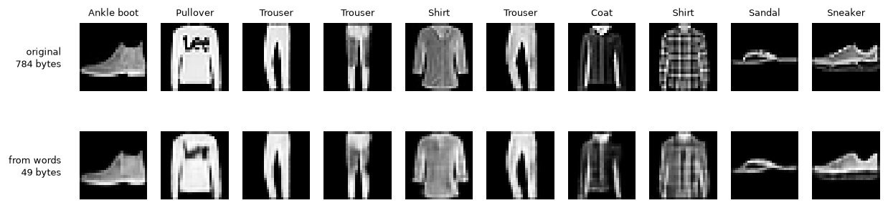

# features-abstractions-meaning

An experiment in building an **AI-native language for ML features**. Models compress what they learn into short "words" from a shared, growing vocabulary, so other models (and a reader LLM) can reuse that meaning instead of relearning it from raw data.

```
  RAW DATA (huge, messy)          THE "NEW LANGUAGE"            READERS
  Entity A: many events   ──►    vector A  ┐                ┌─► other models
  Entity B: ...           ──►    vector B  ├─ library of ───┤   (use as context)
  Entity C: ...           ──►    vector C  ┘   "words"      └─► decoder LLM
```

Like English: a small alphabet, an unlimited vocabulary, and short messages that carry a lot of meaning because the dictionary is shared. See [CLAUDE.md](CLAUDE.md) for the full vision and plan.

**Status:** proof of concept on public data: IBM Telco Customer Churn (7,043 customers, 19 input columns) and Fashion-MNIST (70,000 28×28 clothing images).

## Findings so far

| # | Experiment | Result | Takeaway |
|---|---|---|---|
| 1 | Hand-made feature `num_addon_services` added to the churn model | AUC 0.8448 → 0.8446 (no change) | The feature carries real signal (5% churn at 6 add-ons vs 46% at 1), but the model already learns it from the raw columns. |
| 2 | Autoencoder (model A) squeezes each customer into 4 numbers; model B predicts a new task (long contract) | raw 0.937 · raw+codes 0.936 · codes only 0.904 | 4 learned numbers keep most of the meaning of 18 columns for a task model A never saw, but add nothing on top of raw data. Not smaller than zip. |
| 3 | VQ-VAE: each customer becomes **4 words** from a learned 256-word vocabulary (4 bytes) | words only 0.912 · rebuild error 0.02 (unseen customers: 0.024, so not memorised) · **3.6x smaller than zipped raw data** | The first working form of the "language": a shared dictionary (4 KB) plus a 4-byte message per customer. Lossy, but beats zip on size. Caveat: bigger network and 3x more training than experiment 2's autoencoder, so not a perfectly fair comparison. |
| 4 | Image VQ-VAE (conv encoder, 28→14→7) learns 256 words from 60,000 images (no labels); each image becomes a 7×7 grid of **49 words** (49 bytes vs 784). Model B = logistic regression on 50–5,000 labelled images; both inputs are 784 numbers (pixels vs 49 words × 16-dim codebook vectors) | 50 labels: words 62.0% vs pixels 58.9% (±4) · 100: 69.5% vs 66.2% (±2) · 300 and 1,000: tie · 5,000: 81.1% vs 79.2% · words zipped 395 KB + 16 KB codebook vs 4,281 KB zipped pixels (**10.8x smaller**) | First time words beat raw data: model B learns faster from what model A learned. Gain is modest (~3 points, partly within the spread between random picks). |
| 5 | Experiment 4's words vs standard methods: PCA (49 numbers), PNG, JPEG | Words beat PCA by 9–11 points at 50–100 labels (PCA 50.5% / 58.8%) · rebuild error words 0.0050 vs PCA 0.0121 · 10x smaller than PNG, 4x smaller than JPEG q50 (but JPEG keeps ~3x more detail, rebuild error 0.0016) | Beats PCA, the classic compression for features, and beats file formats on size. Against JPEG it's a different trade-off, not a strict win: logos and fine patterns blur. |

All Telco AUCs are averaged over repeated cross-validation splits (15 for experiment 1, 10 for 2–3), so one lucky test split can't decide a result. In experiments 2–3, model B predicts a different task (long contract vs month-to-month) with the `Contract` column hidden from both models. Image accuracies are averaged over 5 random picks of labelled images per size, tested on the 10,000 test images.

Experiment 4, originals (top, 784 bytes) vs rebuilt from 49 words (bottom, 49 bytes):



### What we've learned

- **On small, clean data, raw features win.** Telco is small and clean; LightGBM finds the patterns itself, even from 50 labels. The learned language matters more where raw data is big, messy, or hard to read directly (images helped; Telco didn't).
- **Discrete words beat continuous codes.** Same idea, but snapping to a vocabulary gave better accuracy and real compression.
- **Messier data gives the language more room.** Images compressed 10.8x (vs 3.6x on Telco), and words helped model B with few labels.
- **Current words are low-level.** Each image word describes a 4×4 patch ("edge here"), not a concept ("shoe sole"). The gain over pixels is modest (~3 points) and partly within noise.

### Next steps

1. **Recursive compression on Fashion-MNIST:** build a second level of words from the first-level 7×7 word grid (words of words), and test whether higher-level words help model B more with few labels. Keep level 2 only if it pays for itself (MDL).
2. **Data with a real time dimension,** so models can learn by predicting what comes next. Cell2Cell and KDD Cup 2009 turned out to be single snapshots without real sequences; the current candidate is the Telecom Italia Milan Big Data Challenge (telecom traffic per grid square over ~2 months).
3. **Later:** the feature library (not built yet) and the decoder LLM.

## Run it

```bash
# everything runs on CPU; fam/compute.py caps training at 30% of the machine (threads, and GPU memory if present)
python -m venv .venv && source .venv/bin/activate   # Windows: .venv\Scripts\activate
pip install -r requirements.txt   # for CPU-only torch: pip install torch --index-url https://download.pytorch.org/whl/cpu
python scripts/download_data.py   # data is downloaded, not committed
python experiments/01_num_addon_services.py
python experiments/02_autoencoder_reuse.py
python experiments/03_vqvae_words.py   # ~3.5 min on 2 CPUs
python experiments/04_fashion_vqvae.py # ~7 min on 2 CPUs; saves model A to data/models/
python experiments/05_vs_standard.py   # needs experiment 4 first
```

## Layout

- `fam/compute.py`: caps every experiment at 30% of the machine's computing power (imported first)
- `fam/data.py`: loading Telco and the shared evaluation (fixed splits, fixed model settings)
- `fam/autoencoder.py`: autoencoder that compresses a customer into a few numbers
- `fam/vqvae.py`: VQ-VAE that writes a customer as words from a learned vocabulary
- `fam/images.py`: loading Fashion-MNIST
- `fam/image_vqvae.py`: image VQ-VAE that writes a picture as a 7×7 grid of words
- `experiments/`: one script per experiment, numbered in order
- `results/`: saved pictures from experiments
- `scripts/download_data.py`: downloads and verifies the datasets
