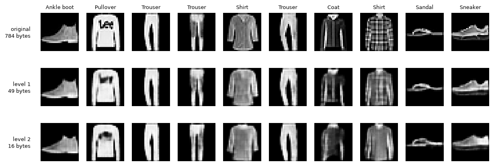
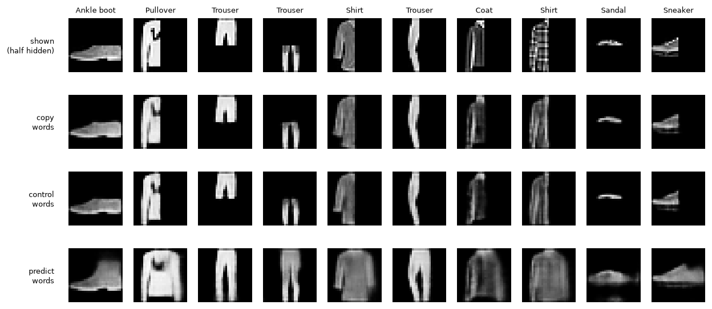
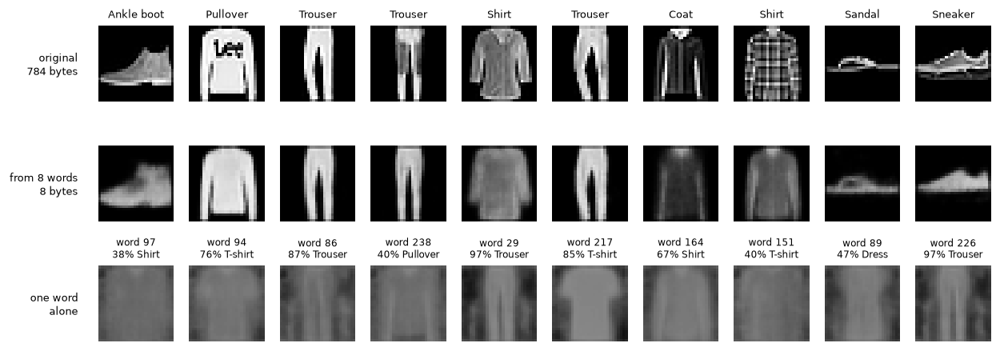
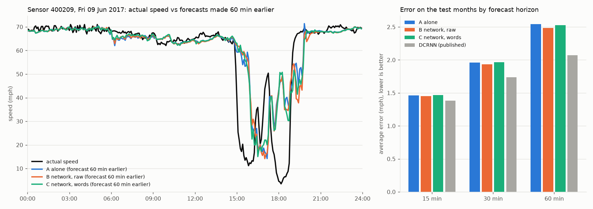

# features-abstractions-meaning

An experiment in building an **AI-native language for ML features**. Models compress what they learn into short "words" from a shared, growing vocabulary, so other models (and a reader LLM) can reuse that meaning instead of relearning it from raw data.

```
  RAW DATA (huge, messy)          THE "NEW LANGUAGE"            READERS
  Entity A: many events   ──►    vector A  ┐                ┌─► other models
  Entity B: ...           ──►    vector B  ├─ library of ───┤   (use as context)
  Entity C: ...           ──►    vector C  ┘   "words"      └─► decoder LLM
```

Like English: a small alphabet, an unlimited vocabulary, and short messages that carry a lot of meaning because the dictionary is shared. See [CLAUDE.md](CLAUDE.md) for the full vision and plan.

**Status:** proof of concept on public data: IBM Telco Customer Churn (7,043 customers, 19 input columns), Fashion-MNIST (70,000 28×28 clothing images) and, from experiment 11, PEMS-BAY road traffic (325 connected sensors, speed every 5 minutes for 6 months).

## Findings so far

| # | Experiment | Result | Takeaway |
|---|---|---|---|
| 1 | Hand-made feature `num_addon_services` added to the churn model | AUC 0.8448 → 0.8446 (no change) | The feature carries real signal (5% churn at 6 add-ons vs 46% at 1), but the model already learns it from the raw columns. |
| 2 | Autoencoder (model A) squeezes each customer into 4 numbers; model B predicts a new task (long contract) | raw 0.937 · raw+codes 0.936 · codes only 0.904 | 4 learned numbers keep most of the meaning of 18 columns for a task model A never saw, but add nothing on top of raw data. Not smaller than zip. |
| 3 | VQ-VAE: each customer becomes **4 words** from a learned 256-word vocabulary (4 bytes) | words only 0.912 · rebuild error 0.02 (unseen customers: 0.024, so not memorised) · **3.6x smaller than zipped raw data** | The first working form of the "language": a shared dictionary (4 KB) plus a 4-byte message per customer. Lossy, but beats zip on size. Caveat: bigger network and 3x more training than experiment 2's autoencoder, so not a perfectly fair comparison. |
| 4 | Image VQ-VAE (conv encoder, 28→14→7) learns 256 words from 60,000 images (no labels); each image becomes a 7×7 grid of **49 words** (49 bytes vs 784). Model B = logistic regression on 50–5,000 labelled images; both inputs are 784 numbers (pixels vs 49 words × 16-dim codebook vectors) | 50 labels: words 62.0% vs pixels 58.9% (±4) · 100: 69.5% vs 66.2% (±2) · 300 and 1,000: tie · 5,000: 81.1% vs 79.2% · words zipped 395 KB + 16 KB codebook vs 4,281 KB zipped pixels (**10.8x smaller**) | First time words beat raw data: model B learns faster from what model A learned. Gain is modest (~3 points, partly within the spread between random picks). |
| 5 | Experiment 4's words vs standard methods: PCA (49 numbers), PNG, JPEG | Words beat PCA by 9–11 points at 50–100 labels (PCA 50.5% / 58.8%) · rebuild error words 0.0050 vs PCA 0.0121 · 10x smaller than PNG, 4x smaller than JPEG q50 (but JPEG keeps ~3x more detail, rebuild error 0.0016) | Beats PCA, the classic compression for features, and beats file formats on size. Against JPEG it's a different trade-off, not a strict win: logos and fine patterns blur. |
| 6 | Words of words: a second VQ-VAE reads only the level-1 words and writes each image as a 4×4 grid of **16 level-2 words** (each summarising a 3×3 block of level-1 words). Model B over 20 picks | 50 labels: pixels 57.4% · level 1 61.3% · level 2 59.5% · 100 labels: 67.9% · 70.5% · 67.8% · level 2 recovers 44% of level-1 words · **29x smaller than zipped pixels** (16 bytes per image) | **Failed the bar fixed in advance** (level 2 was 1.8 / 2.7 points below level 1 at 50 / 100 labels; the bar allowed 1). A 3x shorter message, but it lost meaning model B needed. With 20 picks, level 1's win over pixels holds (+3.9 / +2.6 points). |
| 7 | Same-size test: our words vs a thumbnail and PCA at the same bytes per image (16 and 49), model B over the same 20 picks | Rebuild error: 16 B words 0.0143 vs PCA-16 0.0204 vs 4×4 thumbnail 0.0546 · 49 B words 0.0049 vs PCA-49 0.0121 vs 7×7 thumbnail 0.0330 · 50 labels: 16 B words 59.5% vs PCA-16 58.4% · 49 B words 61.3% vs 7×7 thumbnail 59.7% | **Failed the bar fixed in advance** (+5 points; got +1.1 / +1.7). Compression is real: words keep far more picture than standard methods at the same size. But for learning from few labels, a plain blurry 7×7 thumbnail already beats full pixels (59.7% vs 57.4%), so most of the words' gain over pixels comes from fewer, smoother numbers, not meaning. Also shows PCA-49 is a weak few-label baseline, so experiment 5's 9–11 point win over PCA overstates the words' advantage. |
| 8 | Predict instead of copy: words trained to rebuild the whole image while a random half is hidden (wide view: every word sees the whole image), vs a control with the same wide view trained to copy | Hidden-half rebuild error: predict 0.019 vs control 0.107 vs copy 0.105 · 50 labels: thumbnail 59.7% · copy 61.3% · control 61.7% · predict 60.7% | **Failed the bar fixed in advance** (main: +1.0 vs thumbnail, bar +5; cause: −1.0 vs control, bar +2). The predict model clearly learned what clothes look like (it redraws a hidden boot or trouser leg from the other half), but that knowledge didn't make its words easier for model B to learn classes from. |
| 9 | Reader grid: 4 readers (linear, bag of words, k-NN, small neural net) × thumbnail / copy / control / predict words / predict numbers before the snap × 50, 1,000 and all 60,000 labels | Predict vs control words: −0.1 points with all labels (linear), −1.1 at 50 labels (best reader); never ≥ +2 anywhere · before vs after snap: +0.1 · 60,000 labels, linear: words 86.7% vs thumbnail 81.0% · 50 labels, best: words +3.0 over thumbnail (MLP) · bag of words: 23–26% at 50 labels | **Words problem, by the bar fixed in advance:** experiment 8's hidden-half knowledge isn't in the words in a form any reader can use, and snapping to words loses nothing. But with many labels all our words clearly beat the thumbnail (+5.7 points), so they do hold more than a blur; with 50 labels the labels themselves are the bottleneck. Bag of words fails: these words only mean something at their grid position. |
| 10 | Self-contained words: each image becomes an unordered set of **8 words** (8 bytes); each word draws its own picture layer and the layers are added, so order and position can't carry meaning | **Word purity 70%** (grid words: 17%) · 50 labels: set words 61.3% (8 B) vs thumbnail 59.3% (49 B) vs PCA-8 58.9% (8 B) · bag of words 39.0% at 50 labels, but 71.2% vs 72.6% at 1,000 and 78.4% vs 77.9% at 60,000 · rebuild error 0.021 | **Passed 'words carry meaning', failed 'words are units' (bar fixed in advance).** First words that point to a class on their own (a single word drawn alone looks like a trouser or T-shirt), and 8 bytes beat a 49-byte thumbnail with 50 labels. Counting the words works with 1,000+ labels but not with 50, likely because 256 counts are too many features for 50 examples (untested). Ceiling is lower: 8 bytes can't hold everything (78–79% vs thumbnail 81–87% with all labels). |
| 11 | Raw-data baseline on PEMS-BAY (the standard benchmark: from a sensor's last hour, predict its speed 15 / 30 / 60 min ahead; train on the first 70% of time, test on the last 20%) | Average error (mph): last value 1.60 / 2.18 / 3.04 · LightGBM on raw readings 1.46 / 1.95 / 2.54 · LightGBM trains in ~12 s per horizon on 3M rows · raw data 68 MB (23 MB zipped) · published DCRNN: 1.38 / 1.74 / 2.07 | The bar every traffic experiment must match. Setup checks out: LightGBM lands between 'last value' and the published graph model. A plain model on raw data is already close to DCRNN at 15 min; the gap grows at 60 min, where knowing about neighbouring roads should matter most. |
| 12 | Neighbours' words on PEMS-BAY: each sensor's last hour becomes 2 self-contained words (trained on the training months to describe that hour and predict the next). Same LightGBM: A = own hour; B = + 5 nearest neighbours' raw hours (60 bytes); C = + their words (10 bytes) | Error at 15 / 30 / 60 min (mph): A 1.46 / 1.96 / 2.54 · B 1.45 / 1.93 / 2.48 · C 1.47 / 1.96 / 2.53 · training at 60 min: A 21 s, B 63 s, C 32 s | **Network helps: FAIL** (best cut 2.4%, bar 3%). **Words keep it: PASS on paper, but hollow:** C is within 2% of B only because B barely helps; the words kept about 1/6 of the raw neighbours' small gain (2.53 vs 2.48, A 2.54). Lesson: the bar should have asked words to keep most of the network's gain, not just stay close. All three forecasts still see a jam about an hour late. |

All Telco AUCs are averaged over repeated cross-validation splits (15 for experiment 1, 10 for 2–3), so one lucky test split can't decide a result. In experiments 2–3, model B predicts a different task (long contract vs month-to-month) with the `Contract` column hidden from both models. Image accuracies are averaged over 5 random picks of labelled images per size, tested on the 10,000 test images.

Experiment 4, originals (top, 784 bytes) vs rebuilt from 49 words (bottom, 49 bytes):


Experiment 6, originals (top) vs rebuilt from 49 level-1 words (middle) vs from 16 level-2 words (bottom):



Experiment 8, half of each image hidden (top row) and each model's guess at the whole image. Only the predict model fills in the missing half:



Experiment 10, originals (top), rebuilt from 8 self-contained words (middle), and the 10 most used words each drawn alone, with the class they mostly appear in (bottom):



Experiment 12, one test-month rush hour on sensor 400209: actual speed vs forecasts made 60 minutes earlier (left), and error by horizon against the published DCRNN (right):



### What we've learned

- **On small, clean data, raw features win.** Telco is small and clean; LightGBM finds the patterns itself, even from 50 labels. The learned language matters more where raw data is big, messy, or hard to read directly (images helped; Telco didn't).
- **Discrete words beat continuous codes.** Same idea, but snapping to a vocabulary gave better accuracy and real compression.
- **Messier data gives the language more room.** Images compressed 10.8x (vs 3.6x on Telco), and words helped model B with few labels.
- **Current words are low-level.** Each image word describes a 4×4 patch ("edge here"), not a concept ("shoe sole"). The gain over pixels is modest (~3 points) and partly within noise.
- **Squeezing harder isn't the same as abstracting.** Level 2 was trained to rebuild the level-1 words, so it kept what the image *looks like* at lower resolution (blurrier shapes) rather than what it *is*. Shorter messages, but the lost detail was detail model B used. A rebuild objective may not be enough to make higher-level words more meaningful.
- **Words trained to rebuild are good compressors, not yet meaningful.** At the same size they keep 1.4–2.5x more of the picture than PCA, but a simple thumbnail gets most of their few-label gain. Experiments 2, 6 and 7 all point the same way: to carry meaning, words probably need a different job, such as predicting a hidden part or what comes next, rather than rebuilding the input.
- **Knowing isn't the same as being easy to read.** In experiment 8 the predict model learned real knowledge about clothing shapes, yet model B (a simple linear reader with 50 labels) did no better with its words. The knowledge may sit in the decoder, or in a form a linear reader can't use. Open question: is the problem the words, or the reader?
- **It was the words, not the reader (experiment 9).** No reader (linear, k-NN, neural net) and no amount of labels made the predict words beat the control. The extra knowledge from predicting stays in the model, not in its 49 words. Two more lessons: with all 60,000 labels the words beat a thumbnail by 5.7 points, so they do carry more than a blur, but 50 labels are too few for any reader to use it; and our words are not yet like a language's words, since counting them without their positions loses most of the meaning.
- **Forcing words to stand alone gave them meaning (experiment 10).** When words can't lean on position (an unordered set whose picture layers are added), each word learns a whole-garment concept: word purity jumped from 17% to 70%, and 8 such words beat a 49-byte thumbnail with 50 labels. It's the first step from pixel codes toward a vocabulary. Trade-off: 8 bytes keep less detail, so the ceiling with many labels is lower.
- **Simply adding neighbours isn't enough (experiment 12).** Giving a sensor its 5 nearest neighbours' last hour cut the 60-minute error by only 2.4% (raw) or 0.4% (words), far from the published graph model DCRNN. Likely reasons: the neighbours are picked by distance, not by direction of traffic (upstream jams are what arrive next), and one shared LightGBM can't learn which neighbour matters for which sensor. The network idea needs the connections to carry direction and learned weight, which is what graph models do.

### Next steps

1. **Recursive compression on Fashion-MNIST:** build a second level of words from the first-level 7×7 word grid (words of words), and test whether higher-level words help model B more with few labels. Keep level 2 only if it pays for itself (MDL).

   **Success bar for experiment 6, fixed before running** (level 2: each image as a 4×4 grid = 16 words, each word summarising a 3×3 block of level-1 words; model B averaged over 20 random picks per label size):
   - *Keep level 2 (MDL pass):* at 50 and 100 labels, level-2 words score no more than 1 point below level-1 words, while the message shrinks from 49 to 16 bytes.
   - *Higher-level words help more:* at 50 labels, level-2 words beat level-1 words by at least 2 points.

   **Result: both failed** (−1.8 points at 50 labels, −2.7 at 100). See experiment 6.

   **Success bar for experiment 7, fixed before running** (same-size comparison: is the 29x compression real, or would any 16-byte summary do?): every input stored at 1 byte per number; model B over the same 20 picks as experiment 6.
   - *Level 2 (16 bytes):* at 50 labels, level-2 words beat both a 4×4 thumbnail and PCA-16 by at least 5 points.
   - *Level 1 (49 bytes):* at 50 labels, level-1 words beat both a 7×7 thumbnail and PCA-49 by at least 5 points.

   **Result: both failed** (+1.1 points over PCA-16, +1.7 over the 7×7 thumbnail). See experiment 7.

   **Success bar for experiment 8, fixed before running** (predict instead of copy: during training a random half of each image is hidden in half the batch, and the model must rebuild the whole image; every word sees the whole image. A control model with the same wider view is trained the old way, copying only. Same 49-byte words, same 20 picks):
   - *Main:* at 50 labels, predict-words beat the 7×7 thumbnail by at least 5 points.
   - *Cause:* at 50 labels, predict-words beat the control's words by at least 2 points (so any gain comes from predicting, not the wider view).

   **Result: both failed** (+1.0 points over the thumbnail, −1.0 vs the control). See experiment 8.

   **Success bar for experiment 9, fixed before running** (is the problem the words or the reader? Readers: linear, bag of words, k-NN, small neural net (MLP). Inputs: 7×7 thumbnail, copy / control / predict words from experiment 8, and the predict model's numbers before snapping to words. Labels: 50 (20 picks), 1,000 (5 picks), all 60,000):
   - *Reader problem:* with all 60,000 labels (linear reader), or with the best reader at 50 labels, predict words beat control words by at least 2 points.
   - *Words problem:* no reader at any label size gets predict words 2 points above control words.
   - *Snap loses it:* at 50 labels with the best reader, the predict model's numbers before the snap beat its words by at least 2 points.
   - *Reader rescues the claim:* at 50 labels, some reader gets some words at least 5 points above the thumbnail (with the same reader).

   **Result: words problem.** Reader problem NO (−0.1 / −1.1 points), words problem YES (best +1.8 anywhere), snap loses it NO (+0.1), reader rescues NO (best +3.0). See experiment 9.

   **Success bar for experiment 10, fixed before running** (words as self-contained units: each image becomes an unordered set of 8 words from a 256-word vocabulary, 8 bytes; each word draws its own picture layer and the layers are added, so order and position can't carry meaning. Readers: linear on the word vectors, bag of words, small neural net; same 20 picks at 50 labels):
   - *Words are units:* at 50 labels, the bag-of-words reader scores no more than 2 points below the linear reader on the same words (in experiment 9 it lost ~35 points).
   - *Words carry meaning:* at 50 labels, with the best reader, the 8 words reach at least the 7×7 thumbnail's accuracy (49 bytes, same reader type) and beat PCA-8 (8 bytes) by at least 2 points.

   **Result: words carry meaning PASS** (61.3% vs thumbnail 59.3%, +2.4 over PCA-8); **words are units FAIL** (bag of words −22.2 points at 50 labels, though only −1.4 at 1,000 and +0.5 at 60,000). See experiment 10.

   **Success bar for experiment 12, fixed before running** (PEMS-BAY: do neighbours' words help a sensor forecast? Each sensor's last hour becomes 2 self-contained words from a 256-word dictionary, trained on the training months only to describe that hour and predict the next. Same LightGBM for: A = own last hour; B = own hour + 5 nearest neighbours' raw hours; C = own hour + 5 neighbours' words. Judged on the 60-minute forecast, test period):
   - *Network helps:* B or C cuts A's error by at least 3%.
   - *Words keep it:* C's error is within 2% of B's, while neighbours send at least 5x fewer bytes (2 words vs 12 one-byte readings each).

   **Result: network helps FAIL** (2.4% cut, bar 3%); **words keep it PASS, but only because the raw network gain was small** (words kept ~1/6 of it). See experiment 12.

   **Success bar for experiment 13, fixed before running** (connections with direction: each sensor's 5 nearest neighbours **ahead** (downstream, where a jam's queue starts) or **behind** (upstream), from the directional road distances; same LightGBM and the same hour words as experiment 12; judged on the 60-minute forecast):
   - *Direction matters:* the better direction's raw-neighbour input cuts A's error by at least 3%.
   - *Words keep the gain* (corrected from experiment 12): that direction's words input keeps at least half of the raw input's improvement over A, with neighbours sending at least 5x fewer bytes.
2. **Data with a real time dimension,** so models can learn by predicting what comes next. Cell2Cell and KDD Cup 2009 turned out to be single snapshots without real sequences; the current candidate is the Telecom Italia Milan Big Data Challenge (telecom traffic per grid square over ~2 months).
3. **Later:** the feature library (not built yet) and the decoder LLM.

## Run it

```bash
# everything runs on CPU; fam/compute.py caps training at 30% of the machine (threads, and GPU memory if present)
python -m venv .venv && source .venv/bin/activate   # Windows: .venv\Scripts\activate
pip install -r requirements.txt   # for CPU-only torch: pip install torch --index-url https://download.pytorch.org/whl/cpu
python scripts/download_data.py   # data is downloaded, not committed
python experiments/01_num_addon_services.py
python experiments/02_autoencoder_reuse.py
python experiments/03_vqvae_words.py   # ~3.5 min on 2 CPUs
python experiments/04_fashion_vqvae.py # ~7 min on 2 CPUs; saves model A to data/models/
python experiments/05_vs_standard.py   # needs experiment 4 first
python experiments/06_words_of_words.py # needs experiment 4 first; ~6 min at 4 threads
python experiments/07_same_size.py      # needs experiments 4 and 6; ~30 s
python experiments/08_predict_words.py  # needs experiment 4; ~13 min at 4 threads (trains 2 models)
python experiments/09_reader_grid.py     # needs experiment 8; ~15 min at 4 threads
python experiments/10_set_words.py       # needs experiment 4; ~9 min at 4 threads
python experiments/11_traffic_baseline.py # ~1.5 min
python experiments/12_neighbour_words.py # ~7 min at 4 threads
```

## Layout

- `fam/compute.py`: caps every experiment at 30% of the machine's computing power (imported first)
- `fam/data.py`: loading Telco and the shared evaluation (fixed splits, fixed model settings)
- `fam/autoencoder.py`: autoencoder that compresses a customer into a few numbers
- `fam/vqvae.py`: VQ-VAE that writes a customer as words from a learned vocabulary
- `fam/traffic_words.py`: hour words, writing a sensor's last hour of traffic as 2 self-contained words that also predict the next hour
- `fam/traffic.py`: loading PEMS-BAY road traffic, the sensor road links, and the standard forecasting split
- `fam/images.py`: loading Fashion-MNIST
- `fam/image_vqvae.py`: image VQ-VAE that writes a picture as a 7×7 grid of words
- `fam/set_vqvae.py`: set VQ-VAE that writes an image as an unordered set of 8 self-contained words
- `fam/word_vqvae.py`: level-2 VQ-VAE that writes a 7×7 grid of level-1 words as a 4×4 grid of level-2 words
- `experiments/`: one script per experiment, numbered in order
- `results/`: saved pictures from experiments
- `scripts/download_data.py`: downloads and verifies the datasets
